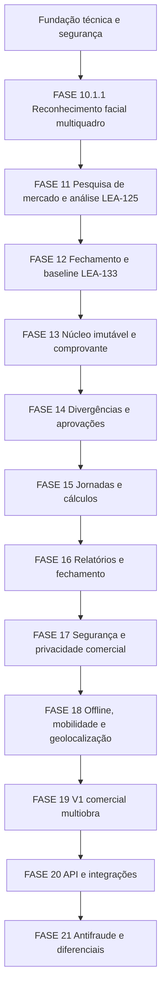

# Controle de Ponto Potiguar — Mapa Oficial de Continuidade

Atualizado em: 2026-07-22

## Finalidade

Este documento é o mapa operacional para impedir desvio do objetivo final do projeto. Ele separa claramente:

- o que já foi entregue;
- o que ainda precisa ser validado;
- a próxima fase confirmada;
- o roadmap futuro ainda não aprovado;
- os gates humanos e jurídicos.

## Objetivo final

Transformar o piloto local de reconhecimento facial em uma plataforma segura, auditável e comercialmente viável de controle de jornada, com foco em empresas com múltiplas obras, equipes externas, baixa conectividade e necessidade de operação simples.

O produto não deve ser anunciado como juridicamente conforme enquanto os requisitos regulatórios não forem validados por especialista.

## Estado estrutural

```text
PROJECT=Controle de Ponto Potiguar
REPOSITORY=leon337/reconhecimento_facial
CURRENT_PHASE=FASE_10.1.1_EM_FECHAMENTO
FUNCTIONAL_VALIDATION=PASS
STATISTICAL_VALIDATION=PENDING
PRODUCTION_HOMOLOGATION=BLOCKED
MARKET_ANALYSIS=PR_29_DRAFT
NEXT_CONFIRMED_PHASE=FASE_12_LEA_133
IMPLEMENTATION_PHASES_13_TO_21=NOT_AUTHORIZED
HOSTING=LINUX_MINT_LOCAL_PILOT
VERCEL_MIGRATION=NOT_AUTHORIZED
```

## Linha de continuidade



## Entregue

### Fundação técnica

- [x] Flask/Gunicorn.
- [x] PostgreSQL 16 e Alembic.
- [x] Docker Compose e Caddy.
- [x] Empresas, obras e isolamento organizacional.
- [x] Colaboradores, usuários e RBAC.
- [x] Auditoria.
- [x] Templates biométricos criptografados e armazenamento privado.
- [x] Scripts de backup e restauração.
- [x] Piloto local no Linux Mint.

### Reconhecimento facial

- [x] Cadastro biométrico por câmera ao vivo.
- [x] Captura multiquadro.
- [x] Galeria e upload bloqueados.
- [x] Identificação automática.
- [x] Entrada e saída.
- [x] Rejeição de rosto não cadastrado.
- [x] Desafio de uso único e liveness passivo multiquadro.
- [x] Testes funcionais no notebook e telefone.
- [x] Tempos observados abaixo de 10 segundos.
- [x] PR #28 integrado por squash.

### Pesquisa de mercado

- [x] Pesquisa competitiva concluída.
- [x] 84 funcionalidades catalogadas.
- [x] Classificação: 15 entregues, 22 parciais, 34 não implementadas, 8 jurídicas e 5 não recomendadas.
- [x] Matriz de lacunas e priorização.
- [x] Escopo MVP, V1, V1.1, V2 e futuro.
- [x] Estratégia de testes.
- [x] Roadmap proposto.
- [x] Documentação publicada no PR #29 como Draft.

## Pendências imediatas

### FASE 10.1.1 — LEA-85

- [ ] LEA-95: executar 20 marcações controladas.
- [ ] LEA-96: calcular média, mediana, P95, máximo e taxa de sucesso.
- [ ] LEA-97: registrar evidências finais.
- [ ] LEA-98: encerrar formalmente a fase.

### FASE 11 — LEA-125

- [ ] Revisar formalmente o PR #29.
- [ ] Retirar o PR #29 do modo Draft somente após revisão.
- [ ] Aprovar e fazer merge documental quando autorizado.
- [ ] Reconciliar LEA-125 e LEA-126 a LEA-132 com os entregáveis publicados.
- [ ] Sincronizar GitHub e Linear após o merge.

## Próxima fase confirmada — FASE 12 / LEA-133

### Bloco A — validação estatística

- [ ] Definir protocolo das 20 marcações.
- [ ] Executar 10 no notebook e 10 no telefone.
- [ ] Distribuir entrada e saída.
- [ ] Registrar sucesso, falha, tempo total, processamento e condições.
- [ ] Calcular métricas.
- [ ] Confirmar ausência de falso positivo.
- [ ] Classificar como PASS, PASS_WITH_WARNINGS ou FAIL.

### Bloco B — backup e restauração

- [ ] Criar backup controlado.
- [ ] Registrar manifesto e checksums.
- [ ] Restaurar PostgreSQL, biometria e chaves em ambiente isolado.
- [ ] Validar login, RBAC, empresa, obra, biometria e marcação.
- [ ] Medir RPO e RTO observados.

### Bloco C — contingência

- [ ] Simular falhas de câmera, rede, servidor e banco.
- [ ] Definir procedimento manual temporário.
- [ ] Definir reconciliação sem duplicidade.
- [ ] Criar e testar runbook operacional.

### Bloco D — legado e domínio imutável

- [ ] Mapear leituras e escritas do modelo `Ponto`.
- [ ] Mapear rotas e serviços dependentes.
- [ ] Comparar `Ponto` com `AttendanceEvent`.
- [ ] Definir adaptador, idempotência, reconciliação e rollback.
- [ ] Planejar retirada gradual do legado.
- [ ] Não executar a migração nesta fase.

### Bloco E — decisões arquiteturais e jurídicas

- [ ] Definir se o produto será interno ou preparado para clientes.
- [ ] Definir papel pretendido: REP-P, coletor, PTRP, combinação ou solução interna.
- [ ] Separar decisão técnica de validação jurídica.
- [ ] Validar com especialistas trabalhistas e de privacidade os itens regulatórios.
- [ ] Não declarar conformidade.

### Gate de saída da FASE 12

- [ ] FASE 10.1.1 formalmente encerrada ou desvios registrados.
- [ ] Restore isolado comprovado.
- [ ] Contingência testada.
- [ ] Dependência do legado documentada.
- [ ] Plano para `AttendanceEvent` aprovado.
- [ ] Decisão REP/PTRP registrada como hipótese ou decisão validada.
- [ ] GitHub e Linear sincronizados.
- [ ] Próxima fase escolhida explicitamente.

## Roadmap futuro — proposta, não autorização

### FASE 13 — núcleo imutável e comprovante

- Migrar a rota viva para `AttendanceEvent`.
- Implementar intervalos, sequência temporal e idempotência.
- Gerar comprovante recuperável.
- Preservar evento original e reduzir o legado.

### FASE 14 — divergências e aprovações

- Solicitação de correção, justificativas e anexos.
- Aprovação ou recusa pelo gestor.
- Ajustes append-only e trilha auditável.

### FASE 15 — jornadas e cálculos

- Jornadas, escalas, múltiplos intervalos e tolerâncias.
- Horas extras, adicional noturno, feriados e banco de horas.
- Cálculos reproduzíveis e explicáveis.

### FASE 16 — relatórios e fechamento

- Relatório diário e painel de pendências.
- Espelho de ponto e fechamento mensal.
- Exportação e conferência do colaborador.

### FASE 17 — segurança e privacidade comercial

- Aviso de privacidade, finalidade, base legal e retenção.
- Direitos do titular, MFA, rate limiting, monitoramento e rotação de chaves.
- Testes de segurança e privacidade.

### FASE 18 — offline, mobilidade e geolocalização

- Decidir PWA ou aplicativo nativo.
- Fila offline protegida e sincronização resiliente.
- GPS, geofence e estações compartilhadas.

### FASE 19 — V1 comercial multiobra

- Centros de custo, equipes, transferências e desligamentos.
- Portal do colaborador, painel do gestor e onboarding.
- Primeiro cliente piloto externo.

### FASE 20 — API e integrações

- API versionada e OpenAPI.
- Webhooks, autenticação e rate limiting.
- Primeiro conector de folha ou ERP.

### FASE 21 — antifraude e diferenciais

- Avaliação de PAD e proteção contra foto, vídeo e deepfake.
- Acessibilidade e baixo consumo de dados.
- PIN ou QR dinâmico como contingência.

## Regras permanentes de governança

1. GitHub é a fonte técnica oficial.
2. Linear representa missões, gates, dependências e decisões.
3. Antes de qualquer nova implementação, consultar nesta ordem:
   - `ROADMAP_CURRENT.md`;
   - `CHECKPOINT.md`;
   - `PROJECT_STATE.md`;
   - issues relacionadas no Linear.
4. Nenhuma fase futura é aprovada automaticamente.
5. Toda implementação deve ter testes unitários e de integração definidos antes do código.
6. Alterações de domínio devem preservar multitenancy, RBAC, auditoria, biometria criptografada e liveness.
7. Nenhuma conclusão jurídica deve ser declarada sem validação especializada.
8. Nenhum dado biométrico real, segredo ou chave deve ser publicado no GitHub.
9. Cada fase deve possuir gate de entrada, gate de saída e evidências reproduzíveis.
10. O objetivo central permanece: controle de jornada simples, seguro, auditável, multiobra e adequado a equipes de campo.

## Próxima ação oficial

```text
NEXT_ACTION=REVIEW_PR_29_AND_RECONCILE_LEA_125_TO_LEA_132
NEXT_OPERATIONAL_PHASE=LEA_133_FASE_12
NEXT_FUNCTIONAL_IMPLEMENTATION=NOT_AUTHORIZED
NEXT_HUMAN_GATE=AUTHORIZE_EXECUTION_OF_LEA_133_AFTER_DOCUMENTAL_SYNC
```
