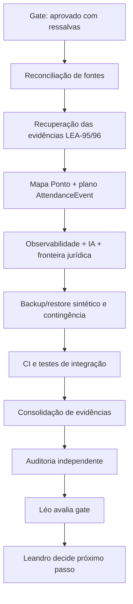

# Controle de Ponto Potiguar — Mapa Oficial de Continuidade

Atualizado em: 2026-08-10

## Finalidade

Este documento define a sequência operacional vigente. A direção estratégica foi aprovada **com ressalvas**; a FASE 12 existe para tornar essas ressalvas verificáveis antes de qualquer nova expansão funcional.

## Estado estrutural

```text
PROJECT=Controle de Ponto Potiguar
REPOSITORY=leon337/reconhecimento_facial
MAIN_SHA=783ca912c38876e68c12439a0db3616bf2b29a1d
BASELINE_FUNCTIONAL_SHA=3908e639be2cd025e4a1eee044db21d1ef52d7ee
CURRENT_PHASE=FASE_12_LEA_133_FECHAMENTO
FUNCTIONAL_VALIDATION=PASS
LEA_95=Done
LEA_96=Done_PASS_WITH_WARNINGS
PRODUCTION_HOMOLOGATION=BLOCKED
LEA_125_TO_132=Done
PR_29=MERGED
PR_30=DRAFT_OPEN
GATE_LEANDRO=APPROVED_WITH_RESERVATIONS
STRATEGIC_DIRECTION=APPROVED
NEW_FUNCTIONAL_PHASE=BLOCKED_UNTIL_NEW_GATE
```

## Linha de montagem vigente


```mermaid
flowchart TD
    A[Gate: aprovado com ressalvas] --> B[Reconciliação de fontes]
    B --> C[Recuperação das evidências LEA-95/96]
    C --> D[Mapa Ponto + plano AttendanceEvent]
    D --> E[Observabilidade + IA + fronteira jurídica]
    E --> F[Backup/restore sintético e contingência]
    F --> G[CI e testes de integração]
    G --> H[Consolidação de evidências]
    H --> I[Auditoria independente]
    I --> J[Léo avalia gate]
    J --> K[Leandro decide próximo passo]
```

## FASE 12 / LEA-133 — estado dos blocos

### Bloco 1 — Reconciliação

- [x] confirmar `main` em `783ca912c38876e68c12439a0db3616bf2b29a1d`;
- [x] confirmar PR #29 integrado;
- [x] confirmar LEA-125 e LEA-126 a LEA-132 concluídas;
- [x] ativar LEA-133 sob gate humano;
- [x] criar PRF Classe C;
- [x] recuperar do histórico a evidência real da LEA-95;
- [x] corrigir o erro temporário que havia movido LEA-95 para Backlog;
- [x] reconciliar LEA-95 para `Done`;
- [x] registrar a lacuna dos 20 tempos individuais em vez de inventá-los;
- [x] concluir LEA-96 como `PASS_WITH_WARNINGS`.

### Bloco 2 — Legado `Ponto`

- [x] mapear escrita viva em `app/punch/routes.py`;
- [x] mapear leitura anti-duplicidade em `app/punch/rules.py`;
- [x] mapear modelo/relacionamentos/testes dependentes;
- [x] confirmar que `AttendanceEvent` existe e é imutável;
- [x] definir `User.employee_id` como ponte obrigatória para o domínio novo;
- [x] definir mapeamento `ENTRADA -> clock_in`, `SAIDA -> clock_out`;
- [x] definir preservação de empresa/obra/timestamp/origem;
- [x] definir idempotência, reconciliação e rollback;
- [x] definir retirada gradual;
- [x] manter migração fora desta fase.

Artefato: `docs/lea-133/02_MAPA_LEGADO_PONTO_E_PLANO_ATTENDANCE_EVENT.md`.

### Bloco 3 — Observabilidade

- [x] classificar request ID, logs, `/health`, DB health, métricas em memória e `processing_ms` como reais;
- [x] registrar métricas em memória como não duráveis;
- [x] registrar câmera/estação/métricas duráveis/backup do piloto como `TELEMETRY_UNAVAILABLE`;
- [x] registrar fila, IA e sync offline como ainda não implementados;
- [x] definir `SEM_TELEMETRIA != SAUDAVEL`;
- [x] definir estados de degradação e telemetria indisponível;
- [x] definir health aggregator futuro;
- [x] separar telemetria técnica de dados trabalhistas.

Artefato: `docs/lea-133/03_OBSERVABILIDADE_IA_E_GUARDRAILS.md`.

### Bloco 4 — IA segura

- [x] selecionar diagnóstico assistido + explicação de eventos como primeiro candidato;
- [x] definir modo somente leitura;
- [x] definir sanitização e campos proibidos;
- [x] definir fallback e `cannot_conclude` quando faltarem sinais;
- [x] proibir aprovação/alteração de jornada e pagamento;
- [x] proibir punição, fraude automática e override biométrico;
- [x] proibir concessão de acesso e exclusão de biometria;
- [x] proibir declaração jurídica pela IA;
- [x] definir testes unitários, integração e avaliação futura.

### Bloco 5 — Backup, restore e contingência

- [x] auditar capacidade existente de dump/manifesto/checksum/restore PostgreSQL;
- [x] identificar que storage biométrico e chave são componentes externos ao dump;
- [x] ampliar Production Validation com fixture biométrica sintética;
- [x] restaurar PostgreSQL em banco vazio no CI;
- [x] restaurar storage biométrico em diretório isolado no CI;
- [x] validar checksum do storage;
- [x] validar descriptografia com chave sintética recuperada;
- [x] validar falha esperada sem chave;
- [x] validar login, RBAC, empresa/obra e punch sintético após restore;
- [x] medir restore do banco em `415ms` no run #63;
- [x] obter `143 passed` na regressão do run #63;
- [x] definir runbook de restore do piloto real;
- [x] definir contingência para câmera, rede, servidor e banco;
- [x] registrar explicitamente que não existe fila offline;
- [x] proibir recibo de sucesso quando persistência falhar;
- [x] adicionar teste explícito de banco indisponível no run posterior;
- [ ] confirmar o resultado do último run do head antes do encerramento final.

Artefato: `docs/lea-133/04_BACKUP_RESTORE_E_CONTINGENCIA.md`.

### Bloco 6 — 20 marcações e métricas

A execução física não precisa ser repetida para provar que ocorreu: a confirmação operacional histórica foi recuperada. O problema real é a perda da série individual de tempos.

```text
LEA_95=Done
TOTAL=20
NOTEBOOK=10
PHONE=10
SUCCESS_RATE=100_PERCENT_BY_OPERATOR_CONFIRMATION
FALSE_POSITIVE=0_REPORTED
ALL_TIMES_LT_10S=REPORTED
```

- [x] 20 marcações confirmadas;
- [x] distribuição 10 notebook + 10 telefone confirmada;
- [x] 0 falsos positivos reportados;
- [x] taxa de sucesso de 100% derivada da confirmação 20/20;
- [x] limite `MAX < 10s` registrado;
- [x] limite `P95 < 10s` registrado;
- [x] três amostras visuais preservadas (`2.9`, `2.9`, `2.8` s);
- [x] média da amostra de três registrada como `2.87s`;
- [x] recusar cálculo exato da série completa sem dados;
- [x] classificar LEA-96 como `PASS_WITH_WARNINGS`;
- [x] manter homologação de produção bloqueada.

Artefato: `docs/lea-133/06_LEA96_METRICAS_E_CLASSIFICACAO.md`.

### Bloco 7 — Fronteira regulatória

- [x] definir direção comercial multiempresa/multiobra;
- [x] registrar `CURRENT_REGULATORY_CLAIM=NONE`;
- [x] separar REP-P/PTRP/coletor/SREP de decisões puramente técnicas;
- [x] marcar biometria/LGPD e requisitos trabalhistas como validação especializada;
- [x] proibir engenharia/IA/marketing de declarar conformidade sem validação.

Artefato: `docs/lea-133/05_DECISAO_ARQUITETURAL_REGULATORIA.md`.

### Bloco 8 — Evidência e auditoria

- [ ] confirmar CI final do último head;
- [ ] atualizar evidência final do restore e teste de DB indisponível;
- [ ] consolidar `docs/lea-133/07_EVIDENCIAS_EXECUCAO.md`;
- [ ] realizar auditoria independente em `docs/lea-133/08_AUDITORIA_INDEPENDENTE.md`;
- [ ] concluir LEA-97;
- [ ] reconciliar LEA-98 e LEA-85 com resultado `PASS_WITH_WARNINGS` sem homologação;
- [ ] encerrar LEA-133 ou registrar desvios finais;
- [ ] entregar novo gate a Leandro.

## Diferença entre ressalva resolvida e funcionalidade implementada

As oito ressalvas do gate são tratadas quando deixam de ser ambíguas e passam a possuir fonte de verdade, evidência, decisão, plano, teste ou fronteira de autoridade. Isso não autoriza dizer que funcionalidades futuras já existem.

Exemplos:

```text
CAMERA_HEARTBEAT=NAO_IMPLEMENTADO
DURABLE_METRICS=NAO_IMPLEMENTADO
AI=NAO_IMPLEMENTADA
PONTO_TO_ATTENDANCE_EVENT_MIGRATION=NAO_IMPLEMENTADA
```

Esses itens passam a ter arquitetura e critérios claros, mas continuam para fases próprias.

## Dívidas que continuam bloqueando homologação de produção

- série completa dos 20 tempos não recuperada;
- P95 exato e alvo estrito `<=8s` não comprováveis;
- restore com volumes/chave reais do piloto não executado pelo CI;
- exercícios físicos de câmera/rede/servidor dependem do ambiente piloto;
- RPO/RTO do piloto não definidos/medidos;
- validação jurídica especializada pendente.

Essas dívidas não são apagadas com o fechamento da FASE 12.

## Direção estratégica aprovada para o próximo gate

Nenhuma destas fases começa automaticamente:

```text
NF_01=PRODUTO_E_DESIGN_SYSTEM
NF_02=REDESIGN_COMERCIAL
NF_03=EXPERIENCIA_OPERACIONAL
NF_04=OBSERVABILIDADE
NF_05=ARQUITETURA_E_PRIMEIRO_MODULO_IA
NF_06=IDENTIDADE_E_DISPOSITIVOS
NF_07=REAVALIACAO_DO_ROADMAP
NF_08=VALIDACOES_TECNICAS_REMANESCENTES
```

A antiga proposta de Fases 13–21 permanece como inventário histórico da LEA-125, não como autorização automática.

## Regras permanentes

1. GitHub é a fonte técnica oficial.
2. Linear representa fases, gates, dependências e decisões.
3. Divergências ficam explícitas na trilha.
4. Sem evidência não há PASS estrito.
5. Testes unitários e de integração precedem futuras implementações funcionais.
6. Multitenancy, RBAC, auditoria, criptografia biométrica e liveness são invariantes.
7. Ausência de telemetria nunca vira estado verde.
8. Nenhum dado biométrico real, segredo ou chave deve ser publicado.
9. IA não toma decisão trabalhista/autoritativa.
10. Conformidade jurídica exige validação especializada.

## Próxima ação oficial

```text
NEXT_ACTION=FINAL_CI_EVIDENCE_INDEPENDENT_AUDIT
NEXT_OPERATIONAL_PHASE=LEA_133
NEXT_FUNCTIONAL_IMPLEMENTATION=BLOCKED
NEXT_HUMAN_GATE=AFTER_AUDIT
```