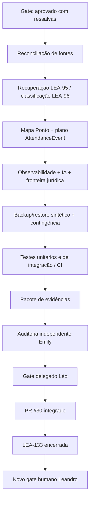

# Controle de Ponto Potiguar — Mapa Oficial de Continuidade

Atualizado em: 2026-08-10

## Estado estrutural

```text
PROJECT=Controle de Ponto Potiguar
REPOSITORY=leon337/reconhecimento_facial
FASE_12_MERGE_SHA=cc640f50dbddc0dd13d38215411c1a75715fe19a
BASELINE_FUNCTIONAL_SHA=3908e639be2cd025e4a1eee044db21d1ef52d7ee
CURRENT_PHASE=FASE_12_LEA_133_CLOSED
FUNCTIONAL_VALIDATION=PASS
LEA_95=Done
LEA_96=Done_PASS_WITH_WARNINGS
LEA_97=Done
LEA_98=Todo_PRODUCTION_GATES_OPEN
LEA_133=Done
PR_29=MERGED
PR_30=MERGED
PRODUCTION_HOMOLOGATION=BLOCKED
NEXT_FUNCTIONAL_PHASE=NOT_STARTED
NEXT_HUMAN_GATE=LEANDRO
```

## Linha de montagem concluída da FASE 12


```mermaid
flowchart TD
    A[Gate: aprovado com ressalvas] --> B[Reconciliação de fontes]
    B --> C[Recuperação LEA-95 / classificação LEA-96]
    C --> D[Mapa Ponto + plano AttendanceEvent]
    D --> E[Observabilidade + IA + fronteira jurídica]
    E --> F[Backup/restore sintético + contingência]
    F --> G[Testes unitários e de integração / CI]
    G --> H[Pacote de evidências]
    H --> I[Auditoria independente Emily]
    I --> J[Gate delegado Léo]
    J --> K[PR #30 integrado]
    K --> L[LEA-133 encerrada]
    L --> M[Novo gate humano Leandro]
```

## Oito ressalvas — encerradas

```text
R1_STALE_BASELINE=RESOLVED
R2_LEA95_AMBIGUITY=RESOLVED
R3_LEA133_NOT_STARTED=RESOLVED
R4_PONTO_DEPENDENCY=RESOLVED_AS_AUDITED_MAP_AND_CONTROLLED_PLAN
R5_OBSERVABILITY_AMBIGUITY=RESOLVED_AS_TRUTH_MATRIX
R6_MISSING_TELEMETRY=RESOLVED_AS_TRUTHFUL_STATE_MODEL
R7_LEGAL_AUTHORITY=RESOLVED_BY_SPECIALIST_BOUNDARY
R8_AI_AUTONOMY=RESOLVED_BY_GUARDRAILS
```

Isso não converte funcionalidades futuras em entregas prontas:

```text
PONTO_TO_ATTENDANCE_EVENT_MIGRATION=NAO_IMPLEMENTADA
CAMERA_HEARTBEAT=NAO_IMPLEMENTADO
STATION_HEARTBEAT=NAO_IMPLEMENTADO
DURABLE_METRICS=NAO_IMPLEMENTADO
AI=NAO_IMPLEMENTADA
OFFLINE_SYNC=NAO_IMPLEMENTADO
```

## Evidência final da FASE 12

```text
PR30_HEAD=b174ab7bb3968970a31a13e1b968eb9178a8389b
CI_RUN_215=PASS
CI_TESTS=PASS
CI_DOCKER_BUILD=PASS
PRODUCTION_VALIDATION_RUN_75=PASS
REGRESSION=143_PASSED
POSTGRES_BACKUP_AND_RESTORE=PASS_SYNTHETIC
BIOMETRIC_STORAGE_RESTORE=PASS_SYNTHETIC
BIOMETRIC_KEY_DEPENDENCY=PASS_SYNTHETIC
DATABASE_UNAVAILABLE_FAIL_CLOSED=PASS
INDEPENDENT_AUDIT=APPROVE_WITH_WARNINGS_FOR_BASELINE_MERGE
LEO_GATE=APPROVE_WITH_WARNINGS_FOR_BASELINE_MERGE
PR_30=MERGED
LEA_133=Done
```

## LEA-95 / LEA-96

```text
TOTAL_CONTROLLED_PUNCHES=20_CONFIRMED_BY_OPERATOR
NOTEBOOK=10
PHONE=10
SUCCESS_RATE=100_PERCENT_BY_OPERATOR_CONFIRMATION
FALSE_POSITIVE=0_REPORTED
ALL_TIMES_LT_10S=REPORTED
LEA_96=PASS_WITH_WARNINGS
STRICT_P95_8S=NOT_PROVABLE
```

Os 20 tempos individuais completos não foram recuperados e não foram reconstruídos artificialmente.

## Legado `Ponto` e `AttendanceEvent`

```text
PONTO_LIVE_WRITE=YES
PONTO_DUPLICATE_READ=YES
ATTENDANCE_EVENT_EXISTS=YES
ATTENDANCE_EVENT_IMMUTABLE=YES
ATTENDANCE_EVENT_LIVE_WRITE=NO
DEPENDENCY_MAP=COMPLETE
CONVERGENCE_PLAN=COMPLETE
MIGRATION_EXECUTED=NO
```

Qualquer migração futura exige idempotência, reconciliação, rollback, preservação histórica e testes unitários/de integração antes do código entrar em produção.

## Observabilidade e IA

Regra permanente: `SEM_TELEMETRIA != SAUDAVEL`.

Estado futuro de IA continua condicionado a módulo somente leitura para diagnóstico/explicação. Decisões trabalhistas, disciplinares, biométricas, de acesso, fraude ou conformidade permanecem fora da autoridade da IA.

## Fronteira regulatória

```text
CURRENT_REGULATORY_CLAIM=NONE
REP_P=VALIDACAO_ESPECIALIZADA_NECESSARIA
PTRP=VALIDACAO_ESPECIALIZADA_NECESSARIA
COLLECTOR_ROLE=VALIDACAO_ESPECIALIZADA_NECESSARIA
LGPD_BIOMETRICS=VALIDACAO_ESPECIALIZADA_NECESSARIA
LEGAL_CONFORMITY_DECLARED=NO
```

## Gates separados de homologação de produção

A FASE 12 foi encerrada, mas produção continua não homologada. Permanecem na LEA-98:

```text
GATE_HOM_01=REPEAT_20_WITH_FULL_TIMING_DATASET
GATE_HOM_02=REAL_PILOT_DISASTER_RECOVERY
GATE_HOM_03=PHYSICAL_CAMERA_NETWORK_SERVER_DB_CONTINGENCY_DRILLS
RPO_PILOT=UNDECIDED
RTO_PILOT=UNMEASURED
LEGAL_SPECIALIST_VALIDATION=PENDING
PRODUCTION_HOMOLOGATION=BLOCKED
```

## Direção estratégica candidata ao novo gate

Nenhum bloco começa automaticamente:

```text
NF_01=PRODUTO_E_DESIGN_SYSTEM
NF_02=REDESIGN_COMERCIAL
NF_03=EXPERIENCIA_OPERACIONAL
NF_04=OBSERVABILIDADE
NF_05=ARQUITETURA_E_PRIMEIRO_MODULO_IA
NF_06=IDENTIDADE_E_DISPOSITIVOS
NF_07=REAVALIACAO_DO_ROADMAP
NF_08=VALIDACOES_TECNICAS_REMANESCENTES
```

## Regras permanentes

1. GitHub é a fonte técnica oficial.
2. Linear representa fases, gates, dependências e decisões.
3. Sem evidência não há PASS estrito.
4. Testes unitários e de integração precedem implementações funcionais.
5. Multitenancy, RBAC, auditoria, criptografia biométrica e liveness são invariantes.
6. Ausência de telemetria nunca vira estado verde.
7. Nenhum dado biométrico real, segredo ou chave deve ser publicado.
8. IA não toma decisão trabalhista/autoritativa.
9. Conformidade jurídica exige validação especializada.
10. O próximo bloco funcional depende de gate humano explícito.

## Próxima ação oficial

```text
FASE_12=COMPLETE
NEXT_ACTION=NEW_HUMAN_GATE
NEXT_FUNCTIONAL_IMPLEMENTATION=BLOCKED_UNTIL_GATE
```