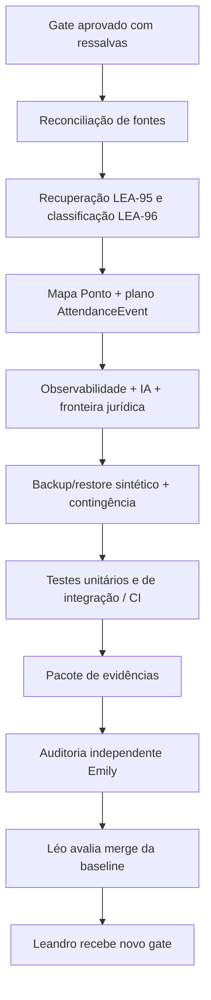

# Controle de Ponto Potiguar — Mapa Oficial de Continuidade

Atualizado em: 2026-08-10

## Finalidade

A direção estratégica foi aprovada **com ressalvas**. A FASE 12 transformou essas ressalvas em uma baseline verificável antes de qualquer nova expansão funcional.

## Estado estrutural

```text
PROJECT=Controle de Ponto Potiguar
REPOSITORY=leon337/reconhecimento_facial
MAIN_SHA_BEFORE_PR30=783ca912c38876e68c12439a0db3616bf2b29a1d
BASELINE_FUNCTIONAL_SHA=3908e639be2cd025e4a1eee044db21d1ef52d7ee
CURRENT_PHASE=FASE_12_LEA_133_BASELINE_COMPLETE
FUNCTIONAL_VALIDATION=PASS
LEA_95=Done
LEA_96=Done_PASS_WITH_WARNINGS
LEA_97=Done
PRODUCTION_HOMOLOGATION=BLOCKED
LEA_125_TO_132=Done
PR_29=MERGED
PR_30=READY_FOR_FINAL_GREEN_CI_AND_BASELINE_MERGE
GATE_LEANDRO=APPROVED_WITH_RESERVATIONS
STRATEGIC_DIRECTION=APPROVED
NEW_FUNCTIONAL_PHASE=BLOCKED_UNTIL_NEW_GATE
```

## Linha de montagem executada


```mermaid
flowchart TD
    A[Gate aprovado com ressalvas] --> B[Reconciliação de fontes]
    B --> C[Recuperação LEA-95 e classificação LEA-96]
    C --> D[Mapa Ponto + plano AttendanceEvent]
    D --> E[Observabilidade + IA + fronteira jurídica]
    E --> F[Backup/restore sintético + contingência]
    F --> G[Testes unitários e de integração / CI]
    G --> H[Pacote de evidências]
    H --> I[Auditoria independente Emily]
    I --> J[Léo avalia merge da baseline]
    J --> K[Leandro recebe novo gate]
```

## FASE 12 / LEA-133 — blocos concluídos

### 1. Reconciliação

- [x] `main` inicial registrada;
- [x] PR #29 confirmado como merged/documental;
- [x] LEA-125 e LEA-126 a LEA-132 reconciliadas como Done;
- [x] LEA-133 ativada sob autorização humana;
- [x] PRF Classe C criado;
- [x] evidência histórica da LEA-95 recuperada;
- [x] movimentação temporária incorreta para Backlog corrigida com trilha preservada;
- [x] LEA-95 reconciliada como Done;
- [x] lacuna real dos 20 tempos individuais registrada;
- [x] LEA-96 concluída como `PASS_WITH_WARNINGS`;
- [x] LEA-97 concluída após consolidação de evidências.

### 2. Legado `Ponto`

- [x] escrita viva mapeada;
- [x] leitura anti-duplicidade mapeada;
- [x] modelos, relacionamentos e testes dependentes inventariados;
- [x] `AttendanceEvent` confirmado como existente e imutável;
- [x] ponte `User.employee_id` definida;
- [x] `ENTRADA -> clock_in` e `SAIDA -> clock_out` definidos;
- [x] preservação de empresa/obra/timestamp/origem definida;
- [x] idempotência, reconciliação e rollback definidos;
- [x] retirada gradual definida;
- [x] migração mantida fora da FASE 12.

Artefato: `docs/lea-133/02_MAPA_LEGADO_PONTO_E_PLANO_ATTENDANCE_EVENT.md`.

### 3. Observabilidade

- [x] sinais reais classificados;
- [x] métricas em memória marcadas como não duráveis;
- [x] câmera/estação/métricas duráveis/backup do piloto marcados como `TELEMETRY_UNAVAILABLE`;
- [x] queue/IA/sync offline marcados como não implementados;
- [x] política `SEM_TELEMETRIA != SAUDAVEL` formalizada;
- [x] health aggregator futuro definido;
- [x] telemetria técnica separada de dados trabalhistas.

### 4. IA segura

- [x] `IA_DIAGNOSTICO` + explicação de eventos selecionados como primeiros candidatos;
- [x] modo somente leitura definido;
- [x] sanitização/campos proibidos definidos;
- [x] `cannot_conclude` quando faltarem sinais;
- [x] decisões trabalhistas, disciplinares, biométricas, de acesso, fraude e conformidade proibidas;
- [x] estratégia de testes unitários, integração e avaliação definida.

### 5. Backup, restore e contingência

Production Validation run #71 (`31438214366`) passou:

```text
REGRESSION=143_PASSED
MIGRATIONS_UP_DOWN_UP=PASS
POSTGRES_BACKUP_CHECKSUM=PASS
POSTGRES_RESTORE_EMPTY_DB=PASS
BIOMETRIC_STORAGE_CHECKSUM_RESTORE=PASS
BIOMETRIC_DECRYPT_WITH_KEY=PASS
BIOMETRIC_DECRYPT_WITHOUT_KEY=EXPECTED_FAIL_PASS
LOGIN_RBAC_ORG_SCOPE_AFTER_RESTORE=PASS
SYNTHETIC_PUNCH_AFTER_RESTORE=PASS
DATABASE_UNAVAILABLE_FAIL_CLOSED=PASS_STATUS_500
SYNTHETIC_KEY_LOG_MASKING=PASS
CI_DATABASE_RESTORE_DURATION=258ms
ARTIFACT_ID=9081842144
ARTIFACT_SHA256=d16350a5c77c2ac36c5d509764bf68f9fb8a5c142334d7a0caad3c27b3f53793
```

- [x] runbook do piloto real definido;
- [x] contingência câmera/rede/servidor/banco definida;
- [x] ausência de fila offline explicitada;
- [x] falso recibo de sucesso proibido.

CI sintético não substitui exercício físico do piloto.

### 6. Vinte marcações e métricas

```text
LEA_95=Done
TOTAL=20
NOTEBOOK=10
PHONE=10
SUCCESS_RATE=100_PERCENT_BY_OPERATOR_CONFIRMATION
FALSE_POSITIVE=0_REPORTED
ALL_TIMES_LT_10S=REPORTED
```

- [x] execução física anterior confirmada no histórico;
- [x] 20/20 sucessos confirmados pelo operador;
- [x] 0 falsos positivos reportados;
- [x] limite `MAX < 10s` registrado;
- [x] limite `P95 < 10s` registrado;
- [x] três amostras visuais preservadas;
- [x] estatísticas exatas da série completa recusadas por ausência dos dados;
- [x] LEA-96 = `PASS_WITH_WARNINGS`;
- [x] homologação de produção mantida bloqueada.

### 7. Fronteira regulatória

- [x] direção comercial multiempresa/multiobra definida;
- [x] `CURRENT_REGULATORY_CLAIM=NONE`;
- [x] REP-P/PTRP/coletor/SREP separados de decisão técnica;
- [x] biometria/LGPD e requisitos trabalhistas sob validação especializada;
- [x] engenharia/IA/marketing proibidos de declarar conformidade sem validação.

### 8. Evidência e auditoria

- [x] pacote consolidado `07_EVIDENCIAS_EXECUCAO.md`;
- [x] contrato de próximo gate `08_CONTRATO_PROXIMO_GATE.md`;
- [x] auditoria independente `09_AUDITORIA_INDEPENDENTE.md`;
- [x] Emily = `APPROVE_WITH_WARNINGS_FOR_BASELINE_MERGE`;
- [x] LEA-97 = Done;
- [x] LEA-98 recebeu gates explícitos de homologação;
- [x] LEA-85 permanece aberta sem falsa homologação;
- [ ] último head documental precisa permanecer verde antes do merge;
- [ ] Léo aplica gate delegado para merge da baseline;
- [ ] PR #30 é integrado;
- [ ] LEA-133 é fechada após merge.

## Oito ressalvas — resultado

```text
R1=RESOLVED
R2=RESOLVED
R3=RESOLVED
R4=RESOLVED_AS_AUDITED_MAP_AND_CONTROLLED_PLAN
R5=RESOLVED_AS_TRUTH_MATRIX
R6=RESOLVED_AS_TRUTHFUL_STATE_MODEL
R7=RESOLVED_BY_SPECIALIST_BOUNDARY
R8=RESOLVED_BY_AI_GUARDRAILS
```

Isso não converte funcionalidades futuras em entregas prontas:

```text
CAMERA_HEARTBEAT=NAO_IMPLEMENTADO
DURABLE_METRICS=NAO_IMPLEMENTADO
AI=NAO_IMPLEMENTADA
PONTO_TO_ATTENDANCE_EVENT_MIGRATION=NAO_IMPLEMENTADA
```

## Gates separados de homologação de produção

Registrados na LEA-98:

```text
GATE_HOM_01=REPEAT_20_WITH_FULL_TIMING_DATASET
GATE_HOM_02=REAL_PILOT_DISASTER_RECOVERY
GATE_HOM_03=PHYSICAL_CAMERA_NETWORK_SERVER_DB_CONTINGENCY_DRILLS
RPO_PILOT=UNDECIDED
RTO_PILOT=UNMEASURED
LEGAL_SPECIALIST_VALIDATION=PENDING
PRODUCTION_HOMOLOGATION=BLOCKED
```

## Direção estratégica candidata ao próximo gate

Nenhum bloco começa automaticamente:

```text
NF_01=PRODUTO_E_DESIGN_SYSTEM
NF_02=REDESIGN_COMERCIAL
NF_03=EXPERIENCIA_OPERACIONAL
NF_04=OBSERVABILIDADE
NF_05=ARQUITETURA_E_PRIMEIRO_MODULO_IA
NF_06=IDENTIDADE_E_DISPOSITIVOS
NF_07=REAVALIACAO_DO_ROADMAP
NF_08=VALIDACOES_TECNICAS_REMANESCENTES
```

## Regras permanentes

1. GitHub é a fonte técnica oficial.
2. Linear representa fases, gates, dependências e decisões.
3. Divergências permanecem rastreáveis.
4. Sem evidência não há PASS estrito.
5. Testes unitários e de integração precedem implementações funcionais.
6. Multitenancy, RBAC, auditoria, criptografia biométrica e liveness são invariantes.
7. Ausência de telemetria nunca vira estado verde.
8. Nenhum dado biométrico real, segredo ou chave deve ser publicado.
9. IA não toma decisão trabalhista/autoritativa.
10. Conformidade jurídica exige validação especializada.

## Próxima ação oficial

```text
NEXT_ACTION=FINAL_GREEN_CI -> LEO_GATE -> PR30_BASELINE_MERGE -> CLOSE_LEA_133
NEXT_FUNCTIONAL_IMPLEMENTATION=BLOCKED
NEXT_HUMAN_GATE=AFTER_BASELINE_MERGE
```