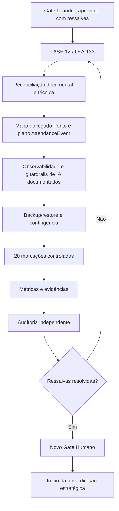

# Controle de Ponto Potiguar — Mapa Oficial de Continuidade

Atualizado em: 2026-08-10

## Finalidade

Este documento define a sequência operacional vigente do projeto. Ele separa:

- estado técnico real;
- dívidas de validação;
- ressalvas obrigatórias;
- direção estratégica aprovada;
- implementação ainda bloqueada;
- gates humanos, técnicos e jurídicos.

## Estado estrutural

```text
PROJECT=Controle de Ponto Potiguar
REPOSITORY=leon337/reconhecimento_facial
MAIN_SHA=783ca912c38876e68c12439a0db3616bf2b29a1d
BASELINE_FUNCTIONAL_SHA=3908e639be2cd025e4a1eee044db21d1ef52d7ee
CURRENT_PHASE=FASE_12_LEA_133_EM_EXECUCAO
FUNCTIONAL_VALIDATION=PASS
STATISTICAL_VALIDATION=PENDING
PRODUCTION_HOMOLOGATION=BLOCKED
LEA_125=Done
PR_29=MERGED
GATE_LEANDRO=APPROVED_WITH_RESERVATIONS
STRATEGIC_DIRECTION=APPROVED
NEW_FUNCTIONAL_PHASE=BLOCKED
HOSTING=LINUX_MINT_LOCAL_PILOT
```

## Regra central do gate de 10/08/2026

Leandro aprovou a direção estratégica proposta pelo Léo com ressalvas e determinou:

> resolver primeiro todas as ressalvas; somente depois avançar para a nova fase.

Fluxo vinculante:


```mermaid
flowchart TD
    A[Gate Leandro: aprovado com ressalvas] --> B[FASE 12 / LEA-133]
    B --> C[Reconciliação documental e técnica]
    C --> D[Mapa do legado Ponto e plano AttendanceEvent]
    D --> E[Observabilidade e guardrails de IA documentados]
    E --> F[Backup/restore e contingência]
    F --> G[20 marcações controladas]
    G --> H[Métricas e evidências]
    H --> I[Auditoria independente]
    I --> J{Ressalvas resolvidas?}
    J -- Não --> B
    J -- Sim --> K[Novo Gate Humano]
    K --> L[Início da nova direção estratégica]
```

## Estado concluído

### Fundação técnica

- [x] Flask/Gunicorn.
- [x] PostgreSQL 16 e Alembic.
- [x] Docker Compose e Caddy.
- [x] Empresas, obras e isolamento organizacional.
- [x] Colaboradores, usuários e RBAC.
- [x] Auditoria.
- [x] Templates biométricos criptografados e armazenamento privado.
- [x] Scripts de backup e restauração existentes.
- [x] Piloto local no Linux Mint.

### Reconhecimento facial funcional

- [x] cadastro biométrico por câmera ao vivo;
- [x] captura multiquadro;
- [x] galeria/upload bloqueados no fluxo novo;
- [x] identificação automática;
- [x] entrada e saída;
- [x] rejeição de rosto não cadastrado;
- [x] desafio de uso único;
- [x] liveness passivo multiquadro;
- [x] testes funcionais em notebook e telefone;
- [x] tempos funcionais observados abaixo de 10 segundos;
- [x] PR #28 integrado.

### Pesquisa de mercado / FASE 11

- [x] 84 funcionalidades catalogadas;
- [x] análise crítica e priorização;
- [x] estratégia de testes;
- [x] documentação publicada;
- [x] PR #29 integrado como documentação apenas;
- [x] LEA-125 e LEA-126 a LEA-132 concluídas.

## FASE 12 / LEA-133 — em execução

Esta é a única fase operacional autorizada agora. Ela não autoriza expansão funcional.

### Bloco 1 — Reconciliação de fontes

- [x] confirmar `main` em `783ca912c38876e68c12439a0db3616bf2b29a1d`;
- [x] confirmar PR #29 integrado;
- [x] confirmar LEA-125 concluída;
- [x] corrigir LEA-95 de `Done` para `Backlog` por ausência de evidência técnica;
- [x] registrar autorização humana para início da LEA-133;
- [x] criar PRF Classe C da missão;
- [ ] concluir sincronização de `CHECKPOINT.md`, `PROJECT_STATE.md`, `ROADMAP_CURRENT.md` e Linear;
- [ ] revisar divergências residuais de LEA-85 e LEA-133.

### Bloco 2 — Legado `Ponto` e domínio imutável

- [ ] mapear todas as leituras de `Ponto`;
- [ ] mapear todas as escritas de `Ponto`;
- [ ] identificar rotas, serviços, relatórios e testes dependentes;
- [ ] comparar invariantes com `AttendanceEvent`;
- [ ] definir adaptador de compatibilidade;
- [ ] definir idempotência;
- [ ] definir reconciliação histórica;
- [ ] definir rollback;
- [ ] definir retirada gradual;
- [ ] não executar migração nesta fase.

### Bloco 3 — Observabilidade

Estado atual aceito como real:

```text
API_HEALTH=REAL
DATABASE_HEALTH=REAL
REQUEST_ID=REAL
STRUCTURED_HTTP_LOGS=REAL
IN_MEMORY_METRICS=REAL_NON_DURABLE
PER_REQUEST_PROCESSING_MS=REAL
```

Telemetria faltante:

```text
CAMERA_HEARTBEAT=UNAVAILABLE
STATION_HEARTBEAT=UNAVAILABLE
DURABLE_METRICS=UNAVAILABLE
BACKUP_LAST_SUCCESS=UNAVAILABLE
QUEUE_TELEMETRY=UNAVAILABLE
AI_HEALTH=UNAVAILABLE
```

Tarefas:

- [ ] definir fonte de verdade de cada indicador;
- [ ] definir estados `LOADING`, `READY`, `WARNING`, `DEGRADED`, `ERROR`, `OFFLINE` e `TELEMETRY_UNAVAILABLE`;
- [ ] proibir estado verde por ausência de dado;
- [ ] definir arquitetura de health aggregator e armazenamento de telemetria;
- [ ] separar dados trabalhistas de telemetria técnica.

### Bloco 4 — IA segura

Primeiro candidato estratégico: diagnóstico assistido + explicação de eventos.

- [ ] definir contrato de entrada somente com dados necessários e sanitizados;
- [ ] definir saída com hipótese, confiança, evidência e próximos passos;
- [ ] definir fallback sem IA;
- [ ] separar `IA_CONFIGURADA`, `IA_ACESSIVEL`, `IA_OPERACIONAL`, `IA_DEGRADADA` e `IA_INDISPONIVEL`;
- [ ] impedir decisão autônoma de RH;
- [ ] impedir override biométrico;
- [ ] impedir concessão de acesso;
- [ ] impedir declaração de fraude ou conformidade;
- [ ] definir avaliação de qualidade e testes adversariais.

### Bloco 5 — Backup, restore e contingência

- [ ] criar backup controlado para validação;
- [ ] registrar manifesto/checksums;
- [ ] restaurar PostgreSQL, biometria e chaves em ambiente isolado;
- [ ] validar autenticação, RBAC, empresa, obra e biometria após restore;
- [ ] medir RPO/RTO observados;
- [ ] testar falha de câmera;
- [ ] testar falha de rede;
- [ ] testar falha de servidor;
- [ ] testar falha de banco;
- [ ] documentar procedimento manual temporário;
- [ ] testar reconciliação sem duplicidade.

### Bloco 6 — LEA-95 e métricas

- [ ] executar 10 marcações no notebook;
- [ ] executar 10 marcações no telefone;
- [ ] distribuir entrada/saída conforme protocolo;
- [ ] registrar resultado, tempo total, processamento e observação;
- [ ] confirmar ausência de falso positivo na amostra;
- [ ] calcular média;
- [ ] calcular mediana;
- [ ] calcular P95;
- [ ] calcular máximo;
- [ ] calcular taxa de sucesso;
- [ ] classificar resultado como `PASS`, `PASS_WITH_WARNINGS` ou `FAIL`.

Esses testes físicos dependem de operador, funcionário controlado e dispositivos reais. Não podem ser substituídos por simulação documental.

### Bloco 7 — Evidência e encerramento

- [ ] atualizar LEA-96 com métricas reais;
- [ ] atualizar LEA-97 com evidências sanitizadas;
- [ ] fechar LEA-98 somente se os gates passarem;
- [ ] fechar LEA-85 somente se a FASE 10.1.1 estiver formalmente concluída;
- [ ] realizar auditoria independente;
- [ ] registrar desvios, se houver;
- [ ] convocar novo gate humano.

## Estratégia de testes

O pipeline é tratado como linha de montagem:

```text
Requisito
  -> Critério de aceitação
  -> Teste unitário
  -> Teste de integração
  -> Teste de contrato
  -> Regressão
  -> Segurança
  -> Observabilidade
  -> Validação operacional
  -> Evidência
  -> Gate
```

Testes unitários e de integração são obrigatórios antes de qualquer futura implementação funcional.

## Direção estratégica aprovada para depois das ressalvas

A direção substitui o uso automático das antigas Fases 13–21 como ordem de implementação.

### NF-01 — Produto e Design System

- consolidar definição do produto;
- arquitetura de informação;
- design tokens;
- componentes reutilizáveis;
- acessibilidade e responsividade.

### NF-02 — Redesign Comercial

- shell administrativo unificado;
- dashboard;
- colaboradores;
- biometria;
- empresas/obras;
- registros recentes;
- saúde operacional visível.

### NF-03 — Experiência Operacional

- experiência de batida simples e isolada;
- feedback claro para colaborador;
- estados de erro/recuperação;
- mensagens acionáveis e request IDs.

### NF-04 — Observabilidade

- health aggregator;
- métricas duráveis;
- heartbeat de estação/câmera quando arquiteturalmente aplicável;
- backup/status operacional;
- eventos/logs/alertas;
- estados degradados reais.

### NF-05 — Arquitetura e Primeiro Módulo de IA

- diagnóstico assistido;
- explicação de eventos;
- modo somente leitura;
- governança, avaliação, fallback e privacidade.

### NF-06 — Identidade e Dispositivos

- consolidar identidade comercial própria;
- definir estações/dispositivos;
- separar marca da semântica de estados.

### NF-07 — Reavaliação do Roadmap

- reclassificar backlog com base na nova experiência e telemetria;
- revisar prioridades comerciais, técnicas, jurídicas e operacionais.

### NF-08 — Retorno às validações técnicas remanescentes

- preservar e fechar dívidas que não tenham sido resolvidas;
- não apagar histórico de validação;
- manter homologação bloqueada enquanto evidência obrigatória faltar.

## Referências históricas — antigas Fases 13–21

As Fases 13–21 derivadas da LEA-125 permanecem como inventário histórico de possibilidades. Elas não são apagadas, mas não constituem autorização automática nem a nova ordem de execução.

## Regras permanentes

1. GitHub é a fonte técnica oficial.
2. Linear representa fases, gates, dependências e decisões.
3. Divergências devem ser registradas explicitamente.
4. Nenhuma nova fase funcional começa antes do gate pós-ressalvas.
5. Testes unitários e de integração devem ser definidos antes do código.
6. Alterações de domínio devem preservar multitenancy, RBAC, auditoria, criptografia biométrica e liveness.
7. Nenhuma conclusão jurídica é válida sem validação especializada.
8. Nenhum dado biométrico real, segredo ou chave pode ser publicado no GitHub.
9. Estados operacionais precisam de fonte de verdade observável.
10. IA não substitui decisão humana em temas trabalhistas, disciplinares, de acesso ou conformidade.

## Próxima ação oficial

```text
NEXT_ACTION=FINISH_RECONCILIATION_AND_PRODUCE_TECHNICAL_BASELINE_ARTIFACTS
NEXT_OPERATIONAL_PHASE=LEA_133
NEXT_PHYSICAL_GATE=LEA_95
NEXT_FUNCTIONAL_IMPLEMENTATION=BLOCKED
NEXT_HUMAN_GATE=AFTER_RESERVATIONS_RESOLVED
```
