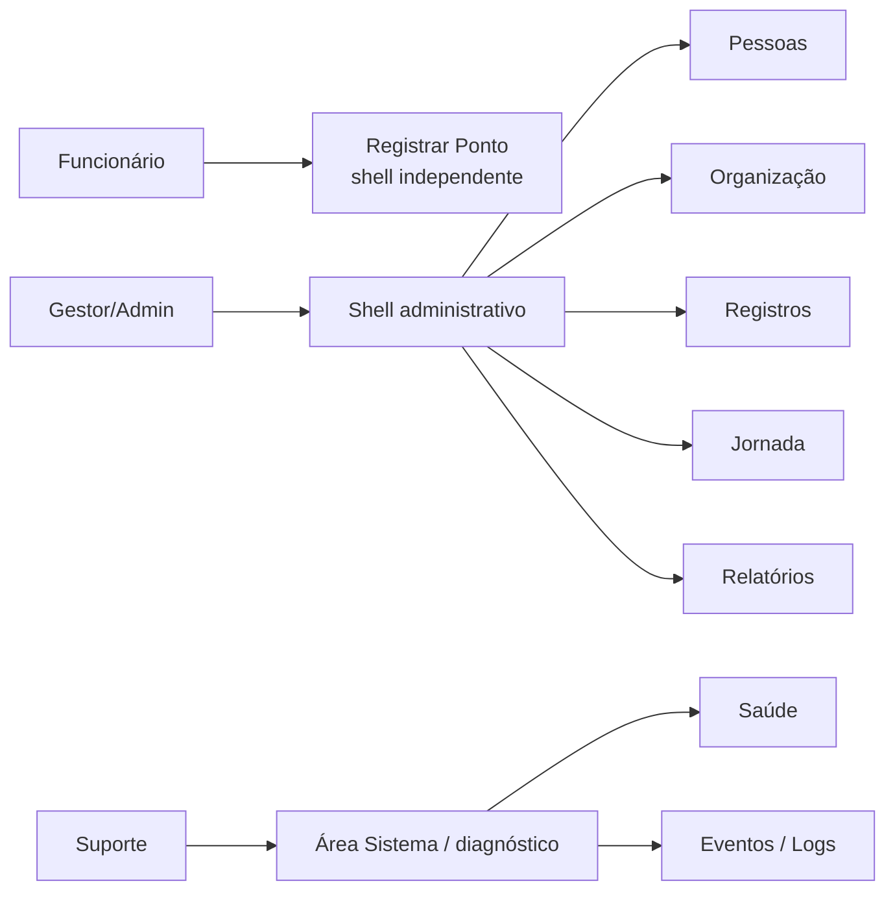

# NF-01 — Definição de Produto

**Projeto:** Controle de Ponto Potiguar  
**NF:** NF-01 — Produto + Design System  
**Natureza:** especificação; sem código de produção  
**Fonte estratégica:** `DECISOES_CONGELADAS.md`  
**Baseline técnica de entrada:** `main@2a388fdc40817dca8f7bd96232e723c0e520702b`

## 1. Definição congelada

> Uma plataforma de controle de jornada para equipes presenciais e de campo, com identificação facial, gestão multiempresa/multiunidade, rastreabilidade operacional e capacidade de diagnóstico do próprio sistema.

A NF-01 não altera essa definição. Ela a transforma em contrato de produto e experiência para a NF-02.

```text
IDENTIDADE
  ↓
RECONHECIMENTO FACIAL
  ↓
REGISTRO DE PONTO
  ↓
JORNADA
  ↓
GESTÃO
  ↓
AUDITORIA
  ↓
OBSERVABILIDADE
  ↓
IA ASSISTIVA
```

## 2. Público e resultado esperado

### Funcionário

Objetivo: registrar a própria jornada com o menor atrito possível e receber confirmação clara do resultado.

Resultado esperado:
- entender rapidamente se o registro foi concluído;
- saber o que fazer quando câmera, reconhecimento ou comunicação falhar;
- não precisar navegar pelo shell administrativo;
- não ser exposto a detalhes técnicos desnecessários.

### Gestor / Administrador

Objetivo: operar pessoas, biometria, organização e registros dentro do escopo autorizado.

Resultado esperado:
- enxergar contexto de empresa/unidade;
- localizar pessoas e registros;
- executar ações compatíveis com RBAC;
- identificar pendências e indisponibilidades sem interpretar logs brutos.

### Suporte

Objetivo: investigar saúde técnica e eventos com evidência rastreável.

Resultado esperado:
- distinguir `HEALTHY`, `DEGRADED`, `UNAVAILABLE`, `UNKNOWN` e `TELEMETRY_UNAVAILABLE`;
- correlacionar falhas por request/event ID;
- nunca receber falso verde por ausência de telemetria.

## 3. Experiências separadas



A tela **Registrar Ponto** não herda sidebar, densidade ou linguagem de suporte. Ela é uma estação operacional simples.

## 4. Capacidades atuais comprovadas

A classificação abaixo descreve o estado real encontrado na `main`, não o roadmap de mercado.

| Capacidade | Estado | Evidência técnica resumida |
|---|---|---|
| Login administrativo | REAL | `/admin/login`, sessão e rate limit |
| RBAC | REAL | papéis e permissões em `app/rbac.py` |
| Funcionários/usuários | REAL | lista + cadastro em `/admin/users` |
| Cadastro biométrico | REAL | câmera ao vivo multiquadro, desafio, duplicidade |
| Remoção biométrica | REAL | POST auditado |
| Registro de ponto | REAL | `/punch`, Entrada/Saída |
| Identificação facial | REAL | reconhecimento por empresa/obra |
| Liveness passivo | REAL | sequência multiquadro |
| Bloqueio temporal de duplicidade | REAL | consulta atual ao legado `Ponto` |
| Company / Worksite | DOMÍNIO REAL | modelos/escopo existem; não há tela dedicada localizada |
| Auditoria | REAL | `AuditEvent` |
| `/health` API + banco | REAL | app responsiva + `SELECT 1` |
| Métricas | REAL NÃO DURÁVEL | contadores em memória |
| Dashboard administrativo | NÃO IMPLEMENTADO | nenhum template/rota localizado |
| Tela de saúde/logs | NÃO IMPLEMENTADA | sinais existem, UI não |
| Relatórios comerciais | NÃO IMPLEMENTADOS | futuro |
| IA operacional | NÃO IMPLEMENTADA | futuro, read-only |
| Offline/sincronização | NÃO IMPLEMENTADO | futuro |

## 5. Fronteira da NF-01

### Em escopo

- definição de produto;
- arquitetura da informação;
- navegação;
- papéis e permissões visuais;
- modelo de estados;
- tokens de Design System;
- catálogo de componentes;
- wireframes conceituais;
- responsividade;
- acessibilidade;
- estratégia de aceite/testes para NF-02.

### Fora de escopo

```text
PRODUCTION_CODE=NO
NF_02_START=NO
PONTO_MIGRATION=NO
AI_IMPLEMENTATION=NO
OBSERVABILITY_BACKEND_IMPLEMENTATION=NO
DEPLOY=NO
PRODUCTION_HOMOLOGATION=NO
LEGAL_CONFORMITY_DECLARATION=NO
```

## 6. Princípios de produto

1. **Verdade antes de estética.** Um estado visual só existe se houver fonte definida.
2. **Simplicidade no ponto.** A jornada do funcionário é curta e isolada.
3. **Contexto organizacional sempre visível no admin.** Empresa/unidade não pode ficar implícita em ações sensíveis.
4. **Permissão precede affordance.** A UI não sugere ação que o papel não pode executar.
5. **Erro acionável.** Mensagens dizem o que ocorreu em linguagem simples e o próximo passo possível.
6. **Ausência de dado não é sucesso.** `TELEMETRY_UNAVAILABLE != HEALTHY`.
7. **Futuro não se passa por presente.** Recursos não implementados são rotulados como futuros/indisponíveis e não simulados.
8. **Acessibilidade é critério de entrada.** Câmera, foco, contraste, mensagens e teclado fazem parte do contrato.
9. **Sem reescrita por redesign.** A NF-02 deve evoluir a UI sobre Flask/Jinja/JS existente.
10. **IA assistiva.** Futuramente explica e diagnostica; não decide jornada, pagamento, punição, biometria, acesso, fraude ou conformidade.

## 7. Jobs-to-be-done prioritários

### JTBD-F01 — Registrar ponto

Quando eu estiver na estação, quero ser identificado e registrar Entrada/Saída rapidamente, para ter confirmação inequívoca da marcação.

### JTBD-A01 — Gerir funcionário

Quando eu administrar uma equipe, quero localizar um funcionário e entender seu estado de cadastro/biometria, para executar a ação permitida sem ambiguidade.

### JTBD-A02 — Cadastrar biometria

Quando eu cadastrar um funcionário, quero concluir a leitura facial ao vivo com orientação de qualidade e erros claros, para reduzir recadastro e associação indevida.

### JTBD-G01 — Consultar operação

Quando eu gerenciar uma unidade, quero consultar registros e pendências do meu escopo, para entender o que aconteceu sem atravessar isolamento organizacional.

### JTBD-S01 — Diagnosticar sistema

Quando houver problema operacional, quero distinguir falha real, degradação e falta de telemetria, para investigar sem conclusões falsas.

## 8. Critérios de produto que a NF-02 deverá preservar

- tela de ponto com uma ação primária por etapa;
- contexto empresa/unidade visível no admin;
- ações destrutivas com confirmação explícita;
- estados de carregamento e falha sem layout quebrado;
- nenhum status técnico derivado apenas de cor ou branding;
- componentes compartilhados para shell administrativo;
- ausência de regressão de câmera, desafio, liveness, reconhecimento, RBAC e isolamento.

## 9. Itens que exigem validação especializada

A especificação visual pode reservar espaço e linguagem para privacidade/conformidade, mas não define obrigação jurídica final. REP/PTRP, papel regulatório, tratamento de biometria e claims legais permanecem sob `VALIDACAO_ESPECIALIZADA_NECESSARIA`.

## 10. Decisão da NF-01 sobre produto

```text
PRODUCT_DEFINITION=FROZEN_AND_TRANSLATED_TO_UI_CONTRACT
THREE_EXPERIENCES=SEPARATE
PUNCH_SHELL=INDEPENDENT
ADMIN_SHELL=REQUIRED_FOR_NF02
SUPPORT_AREA=INFORMATION_ARCHITECTURE_ONLY_IN_NF01
FUTURE_FEATURES=NOT_PRESENTED_AS_LIVE
```