# NF-01 — Arquitetura da Informação e Navegação

## 1. Regra de fechamento

A NF-01 distingue duas camadas que não devem ser confundidas:

1. **Arquitetura completa do produto** — preserva o mapa estratégico e o roadmap.
2. **Navegação visível da experiência inicial** — mostra somente destinos úteis, compreensíveis e compatíveis com capacidades reais ou com UI explicitamente aprovada para materialização.

Cada destino recebe um selo de disponibilidade:

- `REAL`: já existe como interface viva;
- `UI_NF02`: experiência que a NF-02 poderá materializar usando dados/capacidades já disponíveis;
- `FUTURO`: depende de funcionalidade ou backend ainda não implementado;
- `DOMINIO_REAL_UI_FUTURA`: domínio existe, tela dedicada não existe.

A arquitetura não transforma itens futuros em funcionalidades prontas.

## 2. Arquitetura completa do produto

```mermaid
flowchart TD
    ROOT[Controle de Ponto]
    ROOT --> DASH[Dashboard]
    ROOT --> OPE[Operação]
    ROOT --> PES[Pessoas]
    ROOT --> ORG[Organização]
    ROOT --> JOR[Jornada]
    ROOT --> REL[Relatórios]
    ROOT --> INT[Inteligência / PREDIX]
    ROOT --> SIS[Sistema]
    ROOT --> CFG[Configurações]

    OPE --> RP[Registrar Ponto — shell separado]
    OPE --> RR[Registros recentes]
    OPE --> PEN[Pendências]

    PES --> FUN[Funcionários]
    PES --> BIO[Biometria]

    ORG --> EMP[Empresas]
    ORG --> UNI[Obras / Unidades]

    JOR --> REGR[Regras e escalas]
    JOR --> BANCO[Banco de horas]
    JOR --> FEC[Fechamento]

    REL --> RD[Relatório diário]
    REL --> ESP[Espelho / folha]

    INT --> DIA[Diagnóstico assistido]
    INT --> EXPL[Explicação de eventos]

    SIS --> SAU[Saúde operacional]
    SIS --> EVT[Eventos / Logs]
    SIS --> EST[Estações]
    SIS --> BAK[Backup / recuperação]

    CFG --> USR[Usuários e perfis]
    CFG --> SEG[Segurança]
    CFG --> PREF[Preferências]
```



## 3. Navegação visível refinada pela RC-01

A sidebar inicial não deve funcionar como exposição permanente do roadmap. Recursos ainda inexistentes não ocupam a navegação principal apenas para demonstrar intenção futura.

```text
Dashboard

OPERAÇÃO
├─ Registros
└─ Registrar Ponto ↗

GESTÃO
├─ Funcionários
└─ Empresas / Obras

SISTEMA
├─ Saúde operacional
└─ Eventos / Logs

Configurações
```

### Itens preservados no roadmap, mas fora da navegação inicial

```text
Jornada
├─ Regras e escalas
├─ Banco de horas
└─ Fechamento

Relatórios
├─ Relatório diário
└─ Espelho / folha

Inteligência / PREDIX
├─ Diagnóstico assistido
└─ Explicação de eventos

Sistema futuro
├─ Estações
└─ Backup / recuperação
```

Esses recursos voltam à navegação somente quando houver capacidade, permissão, fonte de dados e experiência aprovadas.

### PREDIX

Na NF-01, PREDIX permanece **futuro e read-only**. A RC-01 recomenda que sua primeira materialização seja contextual — painel/assistência dentro de telas autorizadas — em vez de um módulo principal vazio ocupando a sidebar. A decisão não implementa IA e não remove a arquitetura futura de Inteligência.

## 4. Regras da navegação

1. O item ativo deve ser identificável sem depender apenas de cor.
2. Recurso `FUTURO` não ocupa a sidebar inicial por padrão.
3. Quando um recurso planejado precisar aparecer para contexto, deve ser explicitamente rotulado e não oferecer CTA falso.
4. Itens são filtrados por permissão antes de renderizar ações.
5. Empresa e unidade correntes aparecem no header quando o usuário estiver no shell administrativo.
6. A estação `Registrar Ponto` permanece fora da sidebar administrativa; o item na navegação é apenas um acesso para abrir a experiência separada quando autorizado.
7. Mobile usa drawer de navegação; desktop usa sidebar persistente.
8. A sidebar é uma ferramenta operacional, não um catálogo do roadmap.

## 5. Mapa tela por tela

| Área / tela | Usuário | Objetivo | Dados exibidos | Ações | Permissões / regra | Estados mínimos | Dependências | Disponibilidade |
|---|---|---|---|---|---|---|---|---|
| Dashboard | gestor/admin | visão operacional curta | contexto, contagens comprováveis, alertas, recência | abrir detalhe/filtro | dados já autorizados | loading, ready, empty, degraded, telemetry_unavailable, error | consultas reais | UI_NF02; sem dashboard atual |
| Registrar Ponto | funcionário/estação | marcar Entrada/Saída | câmera, etapa, tipo, resultado, tempo | selecionar tipo, registrar tipo selecionado, tentar novamente | contexto de estação; `punch:create` quando aplicável | loading, ready, success, warning, error, offline | câmera, challenge, liveness, reconhecimento | REAL; redesenhar |
| Registros recentes | gestor/auditor | consultar marcações escopadas | pessoa, horário, tipo, unidade, status | buscar, filtrar, ver detalhe | `punch:view` | loading, empty, ready, error, no_permission | `Ponto` atual; futuro AttendanceEvent | UI_NF02 somente se consulta segura for provida; não existe hoje |
| Pendências | gestor/admin | tratar inconsistências | itens incompletos/solicitações | futuro | depende de workflow futuro | empty, ready, warning | domínio futuro | FUTURO; fora da navegação inicial |
| Funcionários | gestor/admin/auditor | localizar pessoas | nome, matrícula, função, biometria, unidade | novo, ver biometria, detalhes | `users:view`; criar exige `users:create` | loading, empty, ready, error, no_permission | User/Employee | REAL; redesenhar |
| Biometria | admin autorizado | cadastrar/recadastrar/remover | pessoa, câmera, progresso, status | capturar, recadastrar, remover | `biometrics:manage` | loading, ready, success, warning, error, no_permission | câmera, challenge, crypto/storage | REAL; redesenhar |
| Empresas / Obras | admin/gestor compatível | entender contexto organizacional | empresa, obra/unidade, estado | consultar; gestão futura | edição exige permissão futura específica | loading, empty, ready, no_permission | Company/Worksite | DOMINIO_REAL_UI_FUTURA |
| Regras e escalas | RH/gestor | administrar jornada | vigência, regras, escalas | futuro | permissões futuras | loading, empty, ready, warning | WorkSchedule e regras | FUTURO; fora da navegação inicial |
| Banco de horas | RH/gestor | consultar saldo | saldo e origem | futuro | permissões futuras | loading, empty, ready, error | cálculos validados | FUTURO; fora da navegação inicial |
| Fechamento | RH/admin | fechar período | pendências, snapshot, status | futuro | autorização futura | ready, warning, error | workflow futuro | FUTURO; fora da navegação inicial |
| Relatórios | gestor/auditor/RH | leitura de período | dados validados | futuro | leitura escopada | loading, empty, ready | consultas futuras | FUTURO; fora da navegação inicial |
| PREDIX / Inteligência | suporte/admin | explicação assistida | sinais sanitizados | analisar/explicar | read-only; sem ações laborais | loading, ready, degraded, telemetry_unavailable, error | IA futura + telemetria | FUTURO; preferir entrada contextual inicial |
| Saúde operacional | suporte/admin | saber o que é observável | API, DB e sinais disponíveis | investigar | permissão futura `system:health` | loading, ready, degraded, error, telemetry_unavailable | `/health`, métricas futuras | UI FUTURA; backend parcial atual |
| Eventos / Logs | suporte/auditor | correlacionar evento | request ID, tipo, duração, resultado | filtrar, copiar ID, detalhar | permissão futura `system:logs` | loading, empty, ready, error | logs/AuditEvent | UI FUTURA |
| Estações | suporte/admin | conhecer comunicação | unidade, última comunicação | futuro | permissão futura | unavailable, telemetry_unavailable | heartbeat inexistente | FUTURO; fora da navegação inicial |
| Backup / recuperação | suporte/admin | conhecer último estado comprovado | último sucesso real | futuro | permissão sensível futura | telemetry_unavailable, ready, warning | telemetria inexistente | FUTURO; fora da navegação inicial |
| Configurações | usuário admin | configurações autorizadas | somente itens permitidos | conforme permissão | RBAC atual + futuras permissões específicas | ready, no_permission | capacidades disponíveis | SHELL; conteúdo cresce progressivamente |

## 6. Navegação por experiência

### Funcionário

```text
Abrir estação
  → câmera
  → selecionar Entrada ou Saída
  → CTA reflete a seleção: Registrar entrada | Registrar saída
  → identificar e registrar
  → resultado
  → pronto para próxima pessoa
```

Sem sidebar, sem relatórios, sem configurações administrativas.

### Gestor/Admin

```text
Login
  → Dashboard
      ↘ Funcionários → Funcionário → Biometria [somente se autorizado]
      ↘ Registros
      ↘ Empresas / Obras
      ↘ Sistema → Saúde / Eventos [somente quando autorizado]
```

### Suporte

```text
Login autorizado
  → Sistema
      → Saúde
      → Eventos / Logs
```

Estações e Backup só entram quando a telemetria correspondente existir.

## 7. Breadcrumb

Padrão:

```text
Área > Recurso > Entidade/ação
```

Exemplos:

```text
Gestão > Funcionários
Gestão > Funcionários > Maria Silva > Biometria
Sistema > Eventos > req_abc123
```

No mobile, mostrar no máximo o pai imediato + título atual; o histórico completo fica acessível por navegação de retorno sem quebrar foco.

## 8. Estratégia de rotulagem

Preferir linguagem de negócio:

- `Funcionários`, não `Users`;
- `Empresas / Obras`, não IDs técnicos;
- `Registros`, não tabela `Ponto`;
- `Saúde operacional`, não `/health`;
- `Eventos / Logs`, não “observability”.

Detalhes técnicos entram em drawers/telas de suporte, não no fluxo do funcionário.

## 9. Convenção de disponibilidade

| Selo | Significado visual |
|---|---|
| sem selo | recurso operacional comprovado |
| `Planejado` | definido na arquitetura, sem operação atual; normalmente fora da sidebar inicial |
| `Telemetria indisponível` | faltam sinais para conclusão técnica |
| `Sem permissão` | usuário não pode acessar; normalmente o item é ocultado |

Não usar `Em breve` para mascarar requisito não aprovado.

## 10. Decisão RC-01

```text
PRODUCT_ARCHITECTURE=FULL_ROADMAP_PRESERVED
VISIBLE_NAVIGATION=SIMPLIFIED
ROADMAP_AS_SIDEBAR=PROHIBITED
PREDIX_INITIAL_ENTRY=CONTEXTUAL_FUTURE_READ_ONLY
PUNCH_SEPARATION=PRESERVED
FUTURE_FEATURES=OUT_OF_PRIMARY_NAV_BY_DEFAULT
EXISTING_VS_FUTURE=EXPLICIT
```