# NF-01 — Arquitetura da Informação e Navegação

## 1. Regra de fechamento

A arquitetura abaixo é a árvore oficial de **produto**, mas cada destino recebe um selo de disponibilidade:

- `REAL`: já existe como interface viva;
- `UI_NF02`: experiência que a NF-02 poderá materializar usando dados/capacidades já disponíveis;
- `FUTURO`: depende de funcionalidade ou backend ainda não implementado;
- `DOMINIO_REAL_UI_FUTURA`: domínio existe, tela dedicada não existe.

A arquitetura não transforma itens futuros em funcionalidades prontas.

## 2. Árvore oficial

```mermaid
flowchart TD
    ROOT[Controle de Ponto]
    ROOT --> DASH[Dashboard]
    ROOT --> OPE[Operação]
    ROOT --> PES[Pessoas]
    ROOT --> ORG[Organização]
    ROOT --> JOR[Jornada]
    ROOT --> REL[Relatórios]
    ROOT --> INT[Inteligência]
    ROOT --> SIS[Sistema]
    ROOT --> CFG[Configurações]

    OPE --> RP[Registrar Ponto — shell separado]
    OPE --> RR[Registros recentes]
    OPE --> PEN[Pendências]

    PES --> FUN[Funcionários]
    PES --> BIO[Biometria]

    ORG --> EMP[Empresas]
    ORG --> UNI[Obras / Unidades]

    JOR --> REGR[Regras e escalas]
    JOR --> BANCO[Banco de horas]
    JOR --> FEC[Fechamento]

    REL --> RD[Relatório diário]
    REL --> ESP[Espelho / folha]

    INT --> DIA[Diagnóstico assistido]
    INT --> EXPL[Explicação de eventos]

    SIS --> SAU[Saúde operacional]
    SIS --> EVT[Eventos / Logs]
    SIS --> EST[Estações]
    SIS --> BAK[Backup / recuperação]

    CFG --> USR[Usuários e perfis]
    CFG --> SEG[Segurança]
    CFG --> PREF[Preferências]
```



## 3. Estrutura de navegação administrativa

### Nível primário

```text
Dashboard
Operação
Pessoas
Organização
Jornada
Relatórios
Inteligência
Sistema
Configurações
```

### Regras

1. O item ativo deve ser identificável sem depender apenas de cor.
2. Itens sem recurso operacional não exibem CTA falso. Quando precisarem aparecer por orientação de roadmap, recebem rótulo `Planejado` e permanecem não acionáveis.
3. Itens são filtrados por permissão antes de renderizar ações.
4. Empresa e unidade correntes aparecem no header quando o usuário estiver no shell administrativo.
5. A estação `Registrar Ponto` permanece fora da sidebar administrativa.
6. Mobile usa drawer de navegação; desktop usa sidebar persistente.

## 4. Mapa tela por tela

| Área / tela | Usuário | Objetivo | Dados exibidos | Ações | Permissões / regra | Estados mínimos | Dependências | Disponibilidade |
|---|---|---|---|---|---|---|---|---|
| Dashboard | gestor/admin | visão operacional curta | contexto, contagens, alertas, recência | abrir detalhe/filtro | dados já autorizados | loading, ready, empty, degraded, telemetry_unavailable, error | consultas/health | UI_NF02; sem dashboard atual |
| Registrar Ponto | funcionário/estação | marcar Entrada/Saída | câmera, etapa, tipo, resultado, tempo | abrir câmera, registrar, tentar novamente | contexto de estação; `punch:create` quando aplicável | loading, ready, success, warning, error, offline | câmera, challenge, liveness, reconhecimento | REAL; redesenhar |
| Registros recentes | gestor/auditor | consultar marcações escopadas | pessoa, horário, tipo, unidade, status | buscar, filtrar, ver detalhe | `punch:view` | loading, empty, ready, error, no_permission | `Ponto` atual; futuro AttendanceEvent | UI_NF02 somente se consulta segura for provida; não existe hoje |
| Pendências | gestor/admin | tratar inconsistências | itens incompletos/solicitações | futuro | depende de workflow futuro | empty, ready, warning | domínio futuro | FUTURO |
| Funcionários | gestor/admin/auditor | localizar pessoas | nome, matrícula, função, biometria, unidade | novo, ver biometria, detalhes | `users:view`; criar exige `users:create` | loading, empty, ready, error, no_permission | User/Employee | REAL; redesenhar |
| Biometria | admin autorizado | cadastrar/recadastrar/remover | pessoa, câmera, progresso, status | capturar, recadastrar, remover | `biometrics:manage` | loading, ready, success, warning, error, no_permission | câmera, challenge, crypto/storage | REAL; redesenhar |
| Empresas | super admin/admin compatível | entender tenant | empresa, estado, unidades | consultar; gestão futura | nova permissão específica deverá existir antes de edição | loading, empty, ready, no_permission | Company | DOMINIO_REAL_UI_FUTURA |
| Obras / Unidades | admin/gestor | entender escopo operacional | código, empresa, estado | consultar; gestão futura | permissão organizacional futura | loading, empty, ready, no_permission | Worksite | DOMINIO_REAL_UI_FUTURA |
| Regras e escalas | RH/gestor | administrar jornada | vigência, regras, escalas | futuro | permissões futuras | loading, empty, ready, warning | WorkSchedule e regras | FUTURO; não ativar |
| Banco de horas | RH/gestor | consultar saldo | saldo e origem | futuro | permissões futuras | loading, empty, ready, error | cálculos validados | FUTURO/PARCIAL de domínio |
| Fechamento | RH/admin | fechar período | pendências, snapshot, status | futuro | autorização de fechamento futura | ready, warning, error | AttendanceClosure/workflow | FUTURO |
| Relatório diário | gestor/auditor | visão operacional | presença, pendências | futuro | leitura escopada | loading, empty, ready | consulta de eventos | FUTURO |
| Espelho / folha | funcionário/RH | consultar período | eventos/cálculos | futuro | acesso próprio/escopado | loading, empty, ready, error | arquitetura regulatória validada | FUTURO |
| Inteligência | suporte/admin | explicação assistida | sinais sanitizados | analisar/explicar | read-only; sem ações laborais | loading, ready, degraded, telemetry_unavailable, error | IA futura + telemetria | FUTURO |
| Saúde operacional | suporte/admin | saber o que é observável | API, DB e sinais disponíveis | investigar | permissão futura `system:health` | loading, ready, degraded, error, telemetry_unavailable | `/health`, métricas futuras | UI FUTURA; backend parcial atual |
| Eventos / Logs | suporte/auditor | correlacionar evento | request ID, tipo, duração, resultado | filtrar, copiar ID, detalhar | permissão futura `system:logs` | loading, empty, ready, error | logs/AuditEvent | UI FUTURA |
| Estações | suporte/admin | conhecer comunicação | unidade, última comunicação | futuro | permissão futura | unavailable, telemetry_unavailable | heartbeat inexistente | FUTURO |
| Backup / recuperação | suporte/admin | conhecer último estado comprovado | último sucesso real | futuro | permissão sensível futura | telemetry_unavailable, ready, warning | telemetria do piloto inexistente | FUTURO |
| Usuários e perfis | super admin/admin | controlar acesso | usuário, papel, escopo | futuro/normalizar | RBAC atual + gestão futura | loading, empty, ready, no_permission | AccessRole | FUTURO como tela própria |
| Segurança | admin/suporte | configurações autorizadas | somente dados não secretos | futuro | privilégio elevado | no_permission, ready | políticas futuras | FUTURO |
| Preferências | usuário admin | preferências de UI | densidade etc. | futuro | própria conta | ready | persistência futura | FUTURO |

## 5. Navegação por experiência

### Funcionário

```text
Abrir estação
  → câmera
  → escolher/confirmar tipo
  → identificar e registrar
  → resultado
  → pronto para próxima pessoa
```

Sem sidebar, sem relatórios, sem configurações administrativas.

### Gestor/Admin

```text
Login
  → Dashboard
      ↘ Pessoas → Funcionário → Biometria
      ↘ Operação → Registros
      ↘ Organização → Empresa / Unidade
      ↘ Sistema → Saúde / Eventos
```

### Suporte

```text
Login autorizado
  → Sistema
      → Saúde
      → Eventos / Logs
      → Estações [quando houver telemetria]
      → Backup [quando houver telemetria]
```

## 6. Breadcrumb

Padrão:

```text
Área > Recurso > Entidade/ação
```

Exemplos:

```text
Pessoas > Funcionários
Pessoas > Funcionários > Maria Silva > Biometria
Sistema > Eventos > req_abc123
```

No mobile, mostrar no máximo o pai imediato + título atual; o histórico completo fica acessível por navegação de retorno sem quebrar foco.

## 7. Estratégia de rotulagem

Preferir linguagem de negócio:

- `Funcionários`, não `Users`;
- `Obras / Unidades`, não IDs técnicos;
- `Registros`, não tabela `Ponto`;
- `Saúde operacional`, não `/health`;
- `Eventos / Logs`, não “observability”.

Detalhes técnicos entram em drawers/telas de suporte, não no fluxo do funcionário.

## 8. Convenção de disponibilidade

| Selo | Significado visual |
|---|---|
| sem selo | recurso operacional comprovado |
| `Planejado` | definido na arquitetura, sem operação atual |
| `Telemetria indisponível` | recurso existe conceitualmente, mas faltam sinais para estado técnico |
| `Sem permissão` | usuário não pode acessar; normalmente o item é ocultado, não desabilitado |

Não usar `Em breve` para mascarar requisito não aprovado.

## 9. Decisão

```text
INFORMATION_ARCHITECTURE=COMPLETE
NAVIGATION_MAP=COMPLETE
PUNCH_SEPARATION=PRESERVED
FUTURE_FEATURES=LABELED
EXISTING_VS_FUTURE=EXPLICIT
```