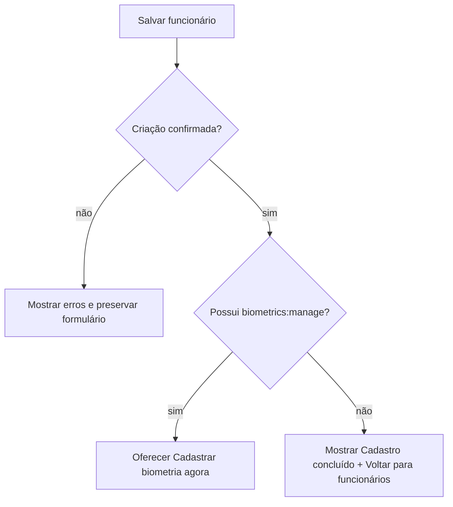

# NF-01 — Papéis, Permissões Visuais e Modelo de Estados

## 1. Princípio

A interface nunca cria autoridade. O backend continua sendo a fonte de autorização; a UI apenas reflete permissões e reduz affordances indevidas.

```text
PERMISSAO_BACKEND
  ↓
NAVEGACAO_VISIVEL
  ↓
ACAO_VISIVEL
  ↓
CONFIRMACAO
  ↓
REQUISICAO
  ↓
AUTORIZACAO_BACKEND NOVAMENTE
```

## 2. RBAC real da baseline

Papéis existentes em `app/rbac.py`:

```text
super_admin
admin
manager
operator
auditor
```

Permissões existentes:

```text
users:view
users:create
biometrics:manage
punch:view
punch:create
```

### Matriz real

| Papel | users:view | users:create | biometrics:manage | punch:view | punch:create |
|---|---:|---:|---:|---:|---:|
| super_admin | ✓ | ✓ | ✓ | ✓ | ✓ |
| admin | ✓ | ✓ | ✓ | ✓ | ✓ |
| manager | ✓ | ✓ | — | ✓ | — |
| operator | — | — | — | — | ✓ |
| auditor | ✓ | — | — | ✓ | — |

A NF-01 não cria novas permissões no backend.

## 3. Personas de experiência ≠ papéis RBAC

| Experiência | Papéis atuais mais próximos | Regra |
|---|---|---|
| Funcionário/Estação | `operator` ou contexto de estação | foco em `punch:create`; sem shell admin |
| Gestor/Admin | `manager`, `admin`, `super_admin` | shell e ações filtradas por permissão |
| Suporte/Auditoria | `auditor` e papéis futuros específicos | leitura/diagnóstico; não presumir acesso técnico inexistente |

`Suporte` é uma experiência de produto futura, não um papel backend atual.

## 4. Regras visuais de permissão

1. **Navegação:** esconder áreas totalmente inacessíveis ao papel.
2. **Ação:** esconder ação que o usuário nunca poderá executar; não usar botão desabilitado como substituto de autorização.
3. **Contexto temporariamente indisponível:** botão pode ficar desabilitado com motivo quando a permissão existe, mas o estado impede a ação.
4. **403 inesperado:** renderizar `NO_PERMISSION` com retorno seguro; não revelar recurso sensível.
5. **Escopo:** empresa/obra correntes devem ser visíveis antes de ações administrativas sensíveis.
6. **Ação destrutiva:** exige confirmação nominal/contextual; backend revalida permissão.
7. **Dados futuros:** não adicionar permissões fictícias à UI.
8. **Próxima etapa:** nenhum fluxo pode anunciar uma próxima ação que o papel atual não possa executar.

## 5. Matriz visual das telas atuais

| Tela / ação | super_admin | admin | manager | operator | auditor |
|---|---|---|---|---|---|
| Lista de funcionários | ver | ver | ver | ocultar | ver |
| Criar funcionário | ação | ação | ação | ocultar | ocultar |
| Cadastrar/recadastrar biometria | ação | ação | ocultar | ocultar | ocultar |
| Remover biometria | ação destrutiva | ação destrutiva | ocultar | ocultar | ocultar |
| Consultar registros (`punch:view`) | futuro de UI | futuro de UI | futuro de UI | ocultar | futuro de UI |
| Registrar ponto (`punch:create`) | capacidade | capacidade | ocultar | capacidade | ocultar |

A tela pública/estação de ponto atual não está protegida por uma sessão administrativa; o modelo futuro de estação deverá preservar escopo e segurança sem fundir essa experiência ao admin.

## 6. Correção RC-01 — fluxo pós-cadastro de funcionário

O fluxo anterior indicava `Próxima etapa: cadastro biométrico` para qualquer usuário que conseguisse criar funcionário. Isso conflita com o RBAC real, porque `manager` possui `users:create` mas não possui `biometrics:manage`.

Fluxo refinado:



### Regra visual

- `super_admin` e `admin`: após criação, podem receber CTA `Cadastrar biometria agora`.
- `manager`: após criação, recebe conclusão e retorno seguro; nenhum CTA de biometria é exibido.
- a UI não revela a existência de ação proibida por meio de botão desabilitado.
- o backend continua revalidando autorização em qualquer requisição de biometria.

## 7. Estados obrigatórios do Design System

| Estado | Significado | Pode executar ação? | Mensagem esperada |
|---|---|---|---|
| `LOADING` | dados/ação em processamento | não, salvo cancelamento seguro | “Carregando…” ou ação específica |
| `EMPTY` | consulta válida sem itens | sim, quando houver CTA permitido | explicar ausência + próximo passo |
| `READY` | dados disponíveis e interação normal | sim | sem banner de status genérico |
| `SUCCESS` | ação concluída e confirmada | conforme fluxo | o que foi concluído + entidade |
| `WARNING` | risco/atenção sem perda total | geralmente sim | impacto + cuidado necessário |
| `DEGRADED` | componente funciona parcialmente | depende da função afetada | o que funciona, o que não, próximo passo |
| `ERROR` | operação falhou | retry quando seguro | falha + ação de recuperação + ID quando aplicável |
| `OFFLINE` | cliente/rede sem conectividade | somente ações explicitamente suportadas offline | não confundir com erro de servidor |
| `NO_PERMISSION` | usuário autenticado sem autorização | não | acesso insuficiente + retorno seguro |
| `TELEMETRY_UNAVAILABLE` | não há sinal suficiente para avaliar saúde | diagnóstico não conclusivo | “Não há telemetria suficiente” |

## 8. Relações semânticas obrigatórias

```text
TELEMETRY_UNAVAILABLE != HEALTHY
NOT_IMPLEMENTED != ERROR
OFFLINE != ERROR
DEGRADED != DOWN
EMPTY != ERROR
WARNING != ERROR
READY != HEALTHY_TECHNICAL_STATUS
```

## 9. Fonte técnica para status “OK”

Nenhum `StatusBadge` com `OK/Healthy` pode ser emitido sem fonte declarada.

| Componente | Fonte real hoje | Status permitido hoje |
|---|---|---|
| API | resposta `/health` | disponível/indisponível para a própria API |
| Banco | `SELECT 1` no `/health` | conectado/não confirmado |
| Câmera da estação | estado local da sessão | pronta/falhou naquela sessão |
| Reconhecimento | resultado de cada tentativa + contadores não duráveis | resultado por tentativa; não saúde persistente |
| Métricas | `/metrics` em memória | dados desde início do processo, não histórico |
| Estação | sem heartbeat | `TELEMETRY_UNAVAILABLE` |
| Backup do piloto | sem last-success telemétrico | `TELEMETRY_UNAVAILABLE` |
| IA | não implementada | `NOT_IMPLEMENTED`, não `ERROR` |
| Fila | não implementada | `NOT_IMPLEMENTED` |
| Offline sync | não implementado | `NOT_IMPLEMENTED` |

## 10. Precedência de estados para componentes

```text
NO_PERMISSION
  > ERROR / UNAVAILABLE
  > OFFLINE
  > DEGRADED
  > TELEMETRY_UNAVAILABLE
  > WARNING
  > LOADING
  > EMPTY
  > READY
```

`SUCCESS` é transacional e temporário; não substitui estado contínuo do recurso.

## 11. Contrato de mensagens

Cada mensagem relevante deve responder, quando aplicável:

```text
O QUE ACONTECEU?
QUAL O IMPACTO?
O QUE POSSO FAZER AGORA?
HÁ UM ID PARA SUPORTE?
```

### Funcionário

Evitar jargão técnico.

```text
Não foi possível confirmar seu rosto.
Aproxime-se da câmera, melhore a iluminação e tente novamente.
```

### Admin

Pode incluir contexto de entidade/unidade.

### Suporte

Pode incluir código técnico e request ID em detalhe expansível/copiável.

## 12. Estados específicos da câmera

```text
CAMERA_UNAVAILABLE
CAMERA_PERMISSION_REQUIRED
CAMERA_READY
CAPTURE_PREPARING
CAPTURING
PROCESSING
CAPTURE_REJECTED
PUNCH_CONFIRMED
```

## 13. Estados de ação destrutiva

Remoção de biometria:

```text
READY
→ CONFIRMATION_REQUIRED
→ LOADING
→ SUCCESS | ERROR
```

O modal deve citar o funcionário e a consequência; nunca usar confirmação genérica “Tem certeza?”.

## 14. Decisão RC-01

```text
ROLE_PERMISSION_MATRIX=COMPLETE
CURRENT_RBAC=PRESERVED
POST_CREATE_BIOMETRIC_FLOW=PERMISSION_AWARE
FORBIDDEN_NEXT_STEP_CTA=PROHIBITED
STATE_MODEL=COMPLETE
FALSE_GREEN=PROHIBITED
```