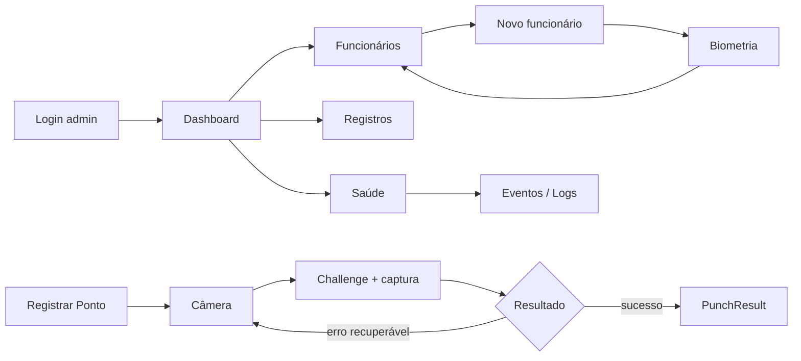

# NF-01 — Wireframes Conceituais

**Natureza:** estrutura e hierarquia, não UI final.  
**Regra:** itens `Planejado` não simulam funcionalidade viva.

## 1. Dashboard administrativo

```text
┌──────────────────────────────────────────────────────────────────────┐
│ Controle de Ponto     Empresa: Potiguar   Unidade: Galpão     [Usu] │
├───────────────┬──────────────────────────────────────────────────────┤
│ Dashboard     │ Dashboard                                            │
│ Operação      │ Visão do seu escopo                                  │
│ Pessoas       │                                                      │
│ Organização   │ ┌────────────┐ ┌────────────┐ ┌───────────────────┐ │
│ Jornada       │ │ Funcionár. │ │ Registros  │ │ Atenções          │ │
│ Relatórios    │ │     24     │ │ hoje: 37   │ │ 2 itens           │ │
│ Inteligência  │ └────────────┘ └────────────┘ └───────────────────┘ │
│ Sistema       │                                                      │
│ Configurações │ ┌──────────────────────────────────────────────────┐ │
│               │ │ Atividade recente                               │ │
│               │ │ 08:02 Entrada — João — Unidade A                │ │
│               │ │ 08:05 Entrada — Maria — Unidade A               │ │
│               │ └──────────────────────────────────────────────────┘ │
│               │                                                      │
│               │ ┌──────────────────────────────────────────────────┐ │
│               │ │ Saúde operacional                               │ │
│               │ │ API [Disponível] DB [Disponível]                │ │
│               │ │ Estações [Telemetria indisponível]              │ │
│               │ └──────────────────────────────────────────────────┘ │
└───────────────┴──────────────────────────────────────────────────────┘
```

Notas:
- métricas somente quando consulta real existir;
- card de estação não pode ficar verde sem heartbeat;
- dashboard deve funcionar sem IA.

## 2. Funcionários

```text
┌──────────────────────────────────────────────────────────────────────┐
│ Pessoas > Funcionários                              [+ Funcionário]  │
│ [Buscar por nome/matrícula________________] [Filtros]                │
├──────────────────────────────────────────────────────────────────────┤
│ Nome            Matrícula     Função       Biometria      Ações     │
│ Maria Silva     00123         Operadora    Ativa          [•••]     │
│ João Souza      00124         Ajudante     Não cadastrada [Cadastrar]│
│ ...                                                                  │
├──────────────────────────────────────────────────────────────────────┤
│ 1–20 de 24                                  [Anterior] 1 2 [Próxima]│
└──────────────────────────────────────────────────────────────────────┘
```

Empty:

```text
Nenhum funcionário cadastrado.
[ Cadastrar primeiro funcionário ]   ← somente se users:create
```

## 3. Cadastro de funcionário

```text
┌─────────────────────────────────────────────────────┐
│ Pessoas > Funcionários > Novo                       │
│ Cadastrar funcionário                               │
│                                                     │
│ Nome completo                                       │
│ [_______________________________________________]   │
│ Matrícula                    Função                  │
│ [____________________]       [___________________]   │
│ Usuário                      Senha                   │
│ [____________________]       [___________________]   │
│ Horário                                              │
│ [_______________________________________________]   │
│ Endereço                                             │
│ [_______________________________________________]   │
│ Tipo de passagem                                     │
│ [_______________________________________________]   │
│                                                     │
│ [Cancelar]                              [Salvar]     │
│                                                     │
│ Próxima etapa após salvar: cadastro biométrico.     │
└─────────────────────────────────────────────────────┘
```

Labels permanecem visíveis; placeholder não é label.

## 4. Cadastro biométrico

```text
┌─────────────────────────────────────────────────────┐
│ Pessoas > Funcionários > Maria Silva > Biometria    │
│ Cadastro biométrico facial                          │
│                                                     │
│ ┌─────────────────────────────────────────────────┐ │
│ │                                                 │ │
│ │                  CÂMERA AO VIVO                 │ │
│ │                                                 │ │
│ └─────────────────────────────────────────────────┘ │
│                                                     │
│ Câmera pronta                                       │
│ Centralize o rosto. Mantenha somente uma pessoa.    │
│                                                     │
│ [ Capturar dados faciais e cadastrar ]              │
│                                                     │
│ Etapa: Leitura facial 3/8                            │
│                                                     │
│ Segurança: fotos da galeria não são aceitas.        │
└─────────────────────────────────────────────────────┘
```

Erro:

```text
Não houve leituras nítidas suficientes.
Melhore a iluminação, mantenha o rosto parado e tente novamente.
[ Tentar novamente ]
```

## 5. Empresas / Obras / Unidades

**Status:** domínio real; tela futura.

```text
┌──────────────────────────────────────────────────────────────────────┐
│ Organização > Empresas e Unidades                                   │
│                                                                      │
│ Empresa atual                                                        │
│ ┌──────────────────────────────────────────────────────────────────┐ │
│ │ Potiguar Locações                         Estado: Ativa          │ │
│ └──────────────────────────────────────────────────────────────────┘ │
│                                                                      │
│ Obras / Unidades                                                     │
│ [Buscar__________________________]                                   │
│                                                                      │
│ Código     Nome                  Estado        Ações                  │
│ GAL-01     Galpão principal      Ativa         [Ver]                 │
│ OBR-02     Obra cliente A        Ativa         [Ver]                 │
└──────────────────────────────────────────────────────────────────────┘
```

Não haverá ação “Nova empresa/unidade” até existir permissão e fluxo backend aprovados.

## 6. Registros recentes

**Status:** tela futura; dados atuais vêm do legado `Ponto` até fase própria de convergência.

```text
┌──────────────────────────────────────────────────────────────────────┐
│ Operação > Registros                                                 │
│ [Hoje ▼] [Unidade ▼] [Tipo ▼] [Buscar funcionário____________]     │
├──────────────────────────────────────────────────────────────────────┤
│ Hora    Funcionário      Tipo       Unidade       Detalhe            │
│ 08:02   João Souza       Entrada    Galpão        [Abrir]            │
│ 08:05   Maria Silva      Entrada    Galpão        [Abrir]            │
│ 12:01   ...              ...        ...           ...                │
└──────────────────────────────────────────────────────────────────────┘
```

DetailDrawer:

```text
Registro
Funcionário: João Souza
Tipo: Entrada
Servidor: 08:02:14
Unidade: Galpão
Origem: biométrica (somente se comprovada)
ID do registro: ...
```

Não exibir conclusão legal ou status de jornada inferido sem regra definida.

## 7. Saúde operacional

```text
┌──────────────────────────────────────────────────────────────────────┐
│ Sistema > Saúde operacional                    Atualizado 10:32:14   │
│                                                                      │
│ ┌──────────────┐ ┌──────────────┐ ┌───────────────────────────────┐ │
│ │ API          │ │ Banco        │ │ Estações                      │ │
│ │ Disponível   │ │ Disponível   │ │ Telemetria indisponível       │ │
│ │ /health      │ │ SELECT 1     │ │ Sem heartbeat implementado    │ │
│ └──────────────┘ └──────────────┘ └───────────────────────────────┘ │
│                                                                      │
│ ┌──────────────────────────────────────────────────────────────────┐ │
│ │ Métricas                                                       │ │
│ │ Fonte: processo atual; não duráveis                            │ │
│ │ Requisições: ...   Falhas: ...   Punch processing: por request │ │
│ └──────────────────────────────────────────────────────────────────┘ │
│                                                                      │
│ [Abrir eventos/logs]                                                 │
└──────────────────────────────────────────────────────────────────────┘
```

A tela deve declarar limitações de cada sinal.

## 8. Eventos / Logs

```text
┌──────────────────────────────────────────────────────────────────────┐
│ Sistema > Eventos / Logs                                             │
│ [Período ▼] [Resultado ▼] [Componente ▼] [Request ID___________]   │
├──────────────────────────────────────────────────────────────────────┤
│ 10:31:44  http_request   201  /punch        824ms      [Detalhe]    │
│ 10:31:12  admin.login    ok   admin          —         [Detalhe]    │
│ 10:30:58  ...                                                        │
└──────────────────────────────────────────────────────────────────────┘
```

Detalhe de suporte:

```text
Request ID: abc123 [Copiar]
Evento: http_request
Status: 201
Duração: 824 ms
Caminho: /punch
Dados sensíveis: não exibidos
```

A NF-01 não implementa armazenamento/consulta nova de logs.

## 9. Registrar Ponto — shell separado

```text
┌──────────────────────────────────────────────┐
│              REGISTRAR PONTO                 │
│                                              │
│ ┌──────────────────────────────────────────┐ │
│ │                                          │ │
│ │              CÂMERA AO VIVO              │ │
│ │                                          │ │
│ └──────────────────────────────────────────┘ │
│                                              │
│ Tipo                                         │
│ [ Entrada ] [ Saída ]                        │
│                                              │
│ Status: Câmera pronta                        │
│                                              │
│ [ IDENTIFICAR E REGISTRAR ]                  │
│                                              │
│ Orientação: olhe para a câmera.               │
└──────────────────────────────────────────────┘
```

Durante captura:

```text
Mantenha o rosto centralizado.
Capturando 4/6
[ processamento em andamento — ação bloqueada ]
```

Success:

```text
✓ Registro concluído
João Souza
Entrada • 08:02:14
[ Pronto para próxima pessoa ]
```

Erro recuperável:

```text
Não foi possível confirmar o rosto.
Melhore a iluminação e tente novamente.
[ Tentar novamente ]
```

Duplicidade:

```text
Registro não repetido.
Aguarde 42 s antes de tentar uma nova marcação.
```

## 10. Login administrativo

```text
┌──────────────────────────────────────────────┐
│ Controle de Ponto                            │
│ Área administrativa                         │
│                                              │
│ Usuário                                      │
│ [________________________________________]   │
│ Senha                                        │
│ [________________________________________]   │
│                                              │
│ [ Entrar ]                                   │
│                                              │
│ Mensagens de erro aparecem aqui, associadas  │
│ ao formulário, sem revelar qual credencial   │
│ estava correta.                              │
└──────────────────────────────────────────────┘
```

## 11. Mobile administrativo — 360 px

```text
┌────────────────────────────┐
│ ☰  Funcionários       [Usu]│
│ Potiguar • Galpão          │
├────────────────────────────┤
│ [Buscar_______________]    │
│ [Filtros] [+ Funcionário]  │
│                            │
│ Maria Silva                │
│ Matrícula 00123            │
│ Biometria: Ativa           │
│ [Ver detalhes]             │
│ ────────────────────────── │
│ João Souza                 │
│ ...                        │
└────────────────────────────┘
```

Tabela pode virar lista estruturada/detalhe; não comprimir cinco colunas até ficarem ilegíveis.

## 12. Fluxo visual principal



## 13. Decisão

```text
WIREFRAMES=COMPLETE
ADMIN_DASHBOARD=SPECIFIED
EMPLOYEES=SPECIFIED
BIOMETRICS=SPECIFIED
COMPANY_WORKSITE=SPECIFIED_AS_FUTURE_UI
RECENT_PUNCHES=SPECIFIED_AS_FUTURE_UI
HEALTH=SPECIFIED_WITH_TRUTH_RULE
EVENTS_LOGS=SPECIFIED
PUNCH=SPECIFIED_AND_SEPARATE
```