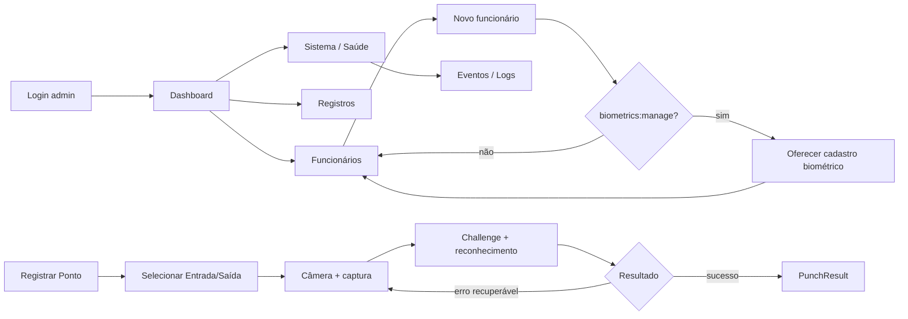

# NF-01 — Wireframes Conceituais — RC-01

**Natureza:** estrutura e hierarquia, não UI final.  
**Regra:** itens futuros não simulam funcionalidade viva.  
**RC-01:** simplifica navegação, separa gestão de diagnóstico técnico, corrige pós-cadastro por permissão e torna a ação de ponto explícita.

## 1. Dashboard administrativo refinado

```text
┌──────────────────────────────────────────────────────────────────────┐
│ Controle de Ponto          Potiguar • Galpão                  [Usu] │
├───────────────┬──────────────────────────────────────────────────────┤
│ Dashboard     │ Dashboard                                            │
│               │ Visão geral da operação                              │
│ OPERAÇÃO      │                                                      │
│ Registros     │ OPERAÇÃO                                             │
│ Registrar ↗   │ ┌────────────┐ ┌────────────┐ ┌───────────────────┐ │
│               │ │Funcionários│ │Registros   │ │Biometria          │ │
│ GESTÃO        │ │ valor real │ │ hoje       │ │ pendências        │ │
│ Funcionários  │ └────────────┘ └────────────┘ └───────────────────┘ │
│ Empresas/Obras│                                                      │
│               │ ATIVIDADE RECENTE                    [Ver registros] │
│ SISTEMA       │ ┌──────────────────────────────────────────────────┐ │
│ Saúde         │ │ 08:02 Entrada — João — Galpão                  │ │
│ Eventos/Logs  │ │ 08:05 Entrada — Maria — Galpão                 │ │
│               │ └──────────────────────────────────────────────────┘ │
│ Configurações │                                                      │
│               │ ATENÇÃO NECESSÁRIA                                  │
│               │ somente itens derivados de fonte real               │
└───────────────┴──────────────────────────────────────────────────────┘
```

Regras:
- números aparecem somente quando consulta real e escopada existir;
- dado inexistente não vira `0` ilustrativo;
- saúde técnica não compete com a operação da equipe no corpo principal;
- acesso a Saúde permanece no grupo `Sistema`;
- Dashboard deve funcionar sem IA;
- PREDIX não ocupa card principal enquanto não existir capacidade real.

## 2. Funcionários

```text
┌──────────────────────────────────────────────────────────────────────┐
│ Gestão > Funcionários                               [+ Funcionário]  │
│ [Buscar por nome/matrícula________________] [Filtros]                │
├──────────────────────────────────────────────────────────────────────┤
│ Nome            Matrícula     Função       Biometria      Ações     │
│ Maria Silva     00123         Operadora    Ativa          [•••]     │
│ João Souza      00124         Ajudante     Não cadastrada [Cadastrar]│
├──────────────────────────────────────────────────────────────────────┤
│ 1–20 de 24                                  [Anterior] 1 2 [Próxima]│
└──────────────────────────────────────────────────────────────────────┘
```

Empty:

```text
Nenhum funcionário cadastrado.
[ Cadastrar primeiro funcionário ]   ← somente se users:create
```

## 3. Cadastro de funcionário — grupos refinados

```text
┌──────────────────────────────────────────────────────────────┐
│ Gestão > Funcionários > Novo                                │
│ Cadastrar funcionário                                       │
│                                                              │
│ DADOS PESSOAIS                                               │
│ Nome completo                                                │
│ [________________________________________________________]   │
│ Endereço                                                     │
│ [________________________________________________________]   │
│                                                              │
│ VÍNCULO OPERACIONAL                                          │
│ Matrícula                    Função                           │
│ [____________________]       [____________________________]  │
│ Horário                      Tipo de passagem                 │
│ [____________________]       [____________________________]  │
│                                                              │
│ ACESSO                                                       │
│ Usuário                      Senha                            │
│ [____________________]       [____________________________]  │
│                                                              │
│ [Cancelar]                                   [Salvar]        │
└──────────────────────────────────────────────────────────────┘
```

Regras:
- labels permanecem visíveis;
- placeholder nunca substitui label;
- se houver múltiplos erros, mostrar resumo + erro associado ao campo;
- campos e valores são preservados quando seguro após falha.

### Pós-cadastro — usuário com `biometrics:manage`

```text
✓ Funcionário cadastrado
Maria Silva foi adicionada com sucesso.

[ Voltar para funcionários ]   [ Cadastrar biometria agora ]
```

### Pós-cadastro — usuário sem `biometrics:manage`

```text
✓ Funcionário cadastrado
Maria Silva foi adicionada com sucesso.

[ Voltar para funcionários ]
```

A UI não mostra botão de biometria desabilitado para quem não possui a permissão.

## 4. Cadastro biométrico

```text
┌─────────────────────────────────────────────────────┐
│ Gestão > Funcionários > Maria Silva > Biometria     │
│ Cadastro biométrico facial                          │
│                                                     │
│ ┌─────────────────────────────────────────────────┐ │
│ │                                                 │ │
│ │                  CÂMERA AO VIVO                 │ │
│ │                                                 │ │
│ └─────────────────────────────────────────────────┘ │
│                                                     │
│ Câmera pronta                                       │
│ Centralize o rosto. Mantenha somente uma pessoa.    │
│                                                     │
│ [ Capturar dados faciais e cadastrar ]              │
│                                                     │
│ Etapa: leitura facial 3/8                            │
│                                                     │
│ Segurança: fotos da galeria não são aceitas.        │
└─────────────────────────────────────────────────────┘
```

Erro:

```text
Não houve leituras nítidas suficientes.
Melhore a iluminação, mantenha o rosto parado e tente novamente.
[ Tentar novamente ]
```

## 5. Empresas / Obras

**Status:** domínio real; tela dedicada futura.

```text
┌──────────────────────────────────────────────────────────────────────┐
│ Gestão > Empresas / Obras                                           │
│                                                                      │
│ Contexto atual                                                       │
│ ┌──────────────────────────────────────────────────────────────────┐ │
│ │ Potiguar Locações • Galpão principal                           │ │
│ └──────────────────────────────────────────────────────────────────┘ │
│                                                                      │
│ Obras / Unidades                                                     │
│ [Buscar__________________________]                                   │
│                                                                      │
│ Código     Nome                  Estado        Ações                  │
│ GAL-01     Galpão principal      Ativa         [Ver]                 │
│ OBR-02     Obra cliente A        Ativa         [Ver]                 │
└──────────────────────────────────────────────────────────────────────┘
```

Não haverá ação de criar/editar empresa ou unidade até existir permissão e fluxo backend aprovados.

## 6. Registros recentes

**Status:** tela futura; dados atuais vêm do legado `Ponto` até fase própria de convergência.

```text
┌──────────────────────────────────────────────────────────────────────┐
│ Operação > Registros                                                 │
│ [Hoje ▼] [Unidade ▼] [Tipo ▼] [Buscar funcionário____________]     │
├──────────────────────────────────────────────────────────────────────┤
│ Hora    Funcionário      Tipo       Unidade       Detalhe            │
│ 08:02   João Souza       Entrada    Galpão        [Abrir]            │
│ 08:05   Maria Silva      Entrada    Galpão        [Abrir]            │
└──────────────────────────────────────────────────────────────────────┘
```

DetailDrawer:

```text
Registro
Funcionário: João Souza
Tipo: Entrada
Servidor: 08:02:14
Unidade: Galpão
Origem: biométrica (somente se comprovada)
ID do registro: ...
```

## 7. Saúde operacional — recência por sinal

```text
┌──────────────────────────────────────────────────────────────────────┐
│ Sistema > Saúde operacional                                         │
│                                                                      │
│ ┌────────────────────┐ ┌────────────────────┐ ┌────────────────────┐│
│ │ API                │ │ Banco              │ │ Estações           ││
│ │ Disponível         │ │ Disponível         │ │ Telemetria indispon.││
│ │ Fonte: /health     │ │ Fonte: SELECT 1    │ │ Sem heartbeat      ││
│ │ Atualizado: 10:32  │ │ Atualizado: 10:32  │ │ Atualização: —     ││
│ └────────────────────┘ └────────────────────┘ └────────────────────┘│
│                                                                      │
│ Métricas                                                             │
│ Fonte: processo atual; não duráveis                                  │
│ [dados somente quando disponíveis]                                   │
│                                                                      │
│ [Abrir eventos/logs]                                                 │
└──────────────────────────────────────────────────────────────────────┘
```

Regras:
- cada `HealthCard` declara sua própria fonte e recência;
- sem sinal técnico suficiente, usar `Telemetria indisponível`;
- horário global não substitui recência específica do sinal.

## 8. Eventos / Logs

```text
┌──────────────────────────────────────────────────────────────────────┐
│ Sistema > Eventos / Logs                                             │
│ [Período ▼] [Resultado ▼] [Componente ▼] [Request ID___________]   │
├──────────────────────────────────────────────────────────────────────┤
│ 10:31:44  http_request   201  /punch        824ms      [Detalhe]    │
│ 10:31:12  admin.login    ok   admin          —         [Detalhe]    │
└──────────────────────────────────────────────────────────────────────┘
```

A NF-01 não implementa armazenamento/consulta nova de logs.

## 9. Registrar Ponto — ação explícita

```text
┌──────────────────────────────────────────────┐
│            CONTROLE DE PONTO                 │
│ Potiguar • Galpão                     08:02  │
│                                              │
│ ┌──────────────────────────────────────────┐ │
│ │                                          │ │
│ │              CÂMERA AO VIVO              │ │
│ │                                          │ │
│ └──────────────────────────────────────────┘ │
│                                              │
│ O que deseja registrar?                      │
│ [   ENTRADA   ]       [    SAÍDA    ]        │
│                                              │
│ Status: Câmera pronta                        │
│                                              │
│ [          REGISTRAR ENTRADA           ]     │
│                                              │
│ Olhe para a câmera e mantenha o rosto        │
│ centralizado.                                │
└──────────────────────────────────────────────┘
```

Regras:
- antes da seleção, CTA final não afirma um tipo incorreto;
- após selecionar `Entrada`, CTA = `Registrar entrada`;
- após selecionar `Saída`, CTA = `Registrar saída`;
- escolha permanece visualmente evidente durante processamento;
- captura continua protegida contra duplo envio.

Durante captura:

```text
Mantenha o rosto centralizado.
Capturando 4/6
Registrando entrada…
```

Success:

```text
✓ Registro concluído
João Souza
Entrada • 08:02:14
[ Pronto para próxima pessoa ]
```

Erro recuperável:

```text
Não foi possível confirmar o rosto.
Melhore a iluminação e tente novamente.
[ Tentar novamente ]
```

Duplicidade:

```text
Registro não repetido.
Aguarde 42 s antes de tentar uma nova marcação.
```

## 10. Login administrativo

```text
┌──────────────────────────────────────────────┐
│ Controle de Ponto                            │
│ Área administrativa                         │
│                                              │
│ Usuário                                      │
│ [________________________________________]   │
│ Senha                                        │
│ [________________________________________]   │
│                                              │
│ [ Entrar ]                                   │
│                                              │
│ Erro de credencial é genérico e associado   │
│ ao formulário.                               │
└──────────────────────────────────────────────┘
```

## 11. Mobile administrativo — 360 px

```text
┌────────────────────────────┐
│ ☰  Funcionários       [Usu]│
│ Potiguar • Galpão          │
├────────────────────────────┤
│ [Buscar_______________]    │
│ [Filtros] [+ Funcionário]  │
│                            │
│ Maria Silva                │
│ Matrícula 00123            │
│ Biometria: Ativa           │
│ [Ver detalhes]             │
│ ────────────────────────── │
│ João Souza                 │
│ ...                        │
└────────────────────────────┘
```

Tabela pode virar lista estruturada/detalhe; não comprimir cinco colunas até ficarem ilegíveis.

## 12. Fluxo visual principal refinado



## 13. Decisão RC-01

```text
WIREFRAMES=REFINED_AFTER_RC01
VISIBLE_NAVIGATION=SIMPLIFIED
DASHBOARD=OPERATION_FIRST
HEALTH=SEPARATED_FROM_PRIMARY_OPERATION
EMPLOYEE_FORM=GROUPED
POST_CREATE_BIOMETRIC_FLOW=PERMISSION_AWARE
HEALTH_RECENCY=PER_SIGNAL
PUNCH_CTA=TYPE_EXPLICIT
PUNCH_SHELL=SEPARATE
```